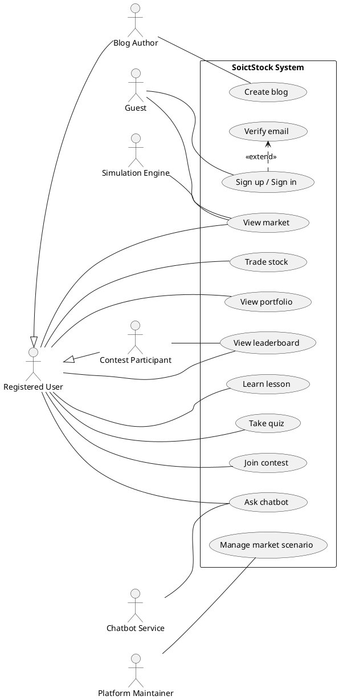
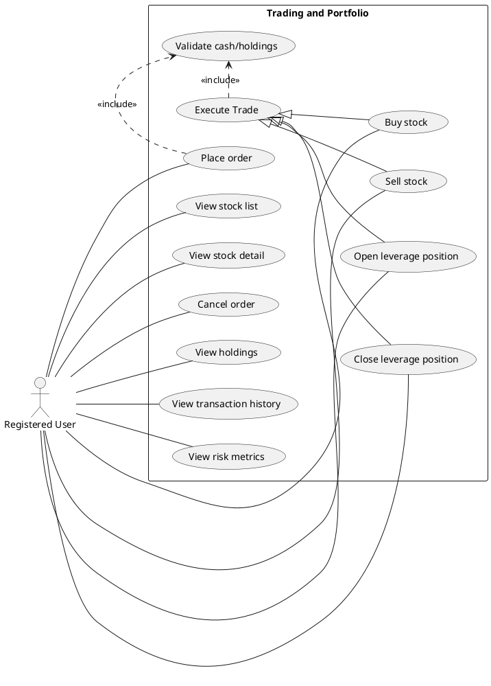
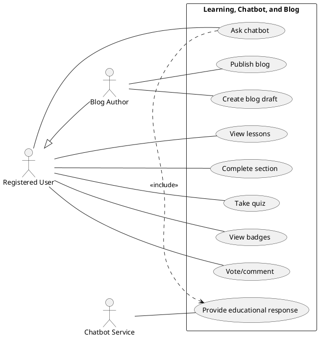
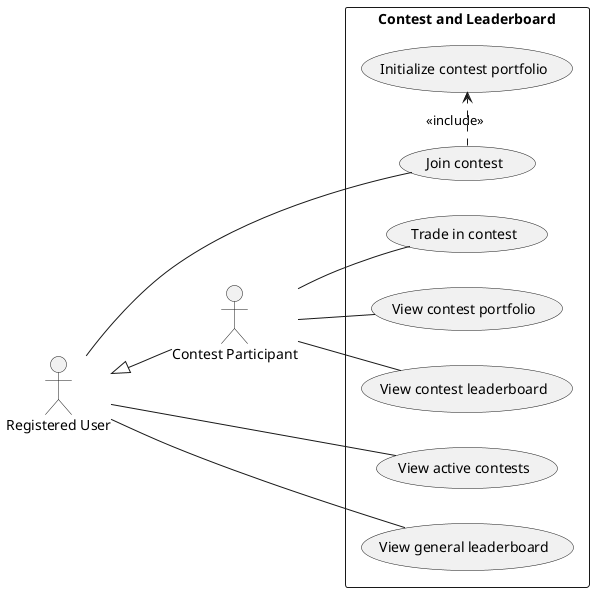

# Chapter 2. Software Requirements Specification

## 2.1 General Introduction

This chapter specifies the requirements of SoictStock from the user’s and system’s perspective. The SRS defines the main actors, use cases, functional requirements, and non-functional requirements. It also provides a basis for system design and testing.

### 2.1.1 Purpose

The purpose of SoictStock is to help users learn stock market concepts through a realistic but risk-free simulation. The system combines trading practice, portfolio tracking, educational content, chatbot support, community discussion, and competitive learning.

### 2.1.2 Definitions

| Term | Definition |
|---|---|
| Virtual stock | A simulated tradable asset representing a fictional or educational stock. |
| Virtual wallet | A simulated cash balance used for educational trading. |
| Portfolio | A collection of virtual cash, stock holdings, transactions, and performance metrics. |
| Order | A request to buy or sell a simulated stock. |
| Leverage position | A margin-based position (Long/Short) allowing users to amplify their simulated exposure. |
| Transaction | A completed trade that updates portfolio cash and holdings. |
| Tick | A generated price update in the simulated market. |
| Market scenario | A predefined market condition such as crisis or inflation that changes price behavior. |
| Learning path | A structured set of lessons, quizzes, and practice tasks. |
| Advisor | A simulated educational assistant, not a real financial advisor. |

## 2.2 System Actors

| Actor | Description |
|---|---|
| Guest | A visitor who can view landing content, public blog posts, and sign-up/sign-in options. |
| Registered user | A user who can trade simulated stocks, view portfolio, learn lessons, take quizzes, create blogs, join contests, and ask the chatbot. |
| Contest participant | A registered user who joins a contest and trades with a contest-specific portfolio. |
| Blog author | A signed-in user who creates, updates, publishes, archives, or deletes their own blog posts. |
| Platform maintainer | A person who maintains the source code, seed data, deployment configuration, and future admin functions. |
| Simulation engine | An internal system component that generates historical prices, real-time ticks, and checks liquidations. |
| News injector | An internal service that injects market news into the simulation context. |
| Chatbot service | An internal service that generates educational responses and suggestion cards based on user messages and safety rules. |

## 2.3 Main Use Cases

| No. | Code | Use case | Description | Actor |
|---|---|---|---|---|
| 1 | UC-01 | Create blog | Create a new blog draft, edit content, publish, archive, or delete. | Blog Author |
| 2 | UC-02 | Verify email | Verify the newly created account via an email link before signing in. | Guest |
| 3 | UC-03 | Sign up / Sign in | Register a new account or log in to an existing account. | Guest |
| 4 | UC-04 | View market | View market dashboard, stock list, stock quotes, and historical price charts. | Registered User |
| 5 | UC-05 | Trade stock | Place orders, execute buy/sell trades, open/close leverage positions, and cancel open orders. | Registered User |
| 6 | UC-06 | View portfolio | View cash balance, current holdings, transaction history, and risk metrics. | Registered User |
| 7 | UC-07 | View leaderboard | View general platform leaderboard and see user rankings based on portfolio performance. | Registered User |
| 8 | UC-08 | Learn lesson | View learning paths, read lesson content, and mark sections as completed. | Registered User |
| 9 | UC-09 | Take quiz | Answer and submit quizzes related to learning paths and view scores. | Registered User |
| 10 | UC-10 | Join contest | View active contests, join a contest, and trade in a contest-specific portfolio arena. | Contest Participant |
| 11 | UC-11 | Ask chatbot | Ask educational questions about the platform, trading concepts, and risk. | Registered User |
| 12 | UC-12 | Manage market scenario | Trigger predefined market scenarios such as crisis or inflation to affect simulation prices. | Platform Maintainer |

## 2.4 Use Case Diagrams

Phần này bao gồm 1 overall use case và 3 level-2 use case. Các biểu đồ dưới đây được định dạng theo cấu trúc UML (PlantUML) hỗ trợ đầy đủ các quan hệ như yêu cầu: association, include, extend, generalization. Bạn có thể sử dụng plugin PlantUML trên VSCode hoặc website PlantUML để render thành hình ảnh tương tự như mẫu (có bounding box, actor ngoài, use case trong).

### Diagram 1: Overall Use Case Diagram
Mức độ: Bắt buộc.

### Diagram 2: Level-2 Use Case Diagram — Trading and Portfolio
Mức độ: Bắt buộc.

### Diagram 3: Level-2 Use Case Diagram — Learning, Chatbot, and Blog
Mức độ: Nên vẽ.

### Diagram 4: Level-2 Use Case Diagram — Contest and Leaderboard
Mức độ: Nên vẽ.

## 2.5 Use Case Specifications

### 2.5.1 UC-01: Create blog
* **Actor**: Blog Author
* **Precondition**: The user is signed in and navigated to the blog management page.
* **Main flow**: The author creates a new draft, edits the title and content, and saves it. The author then chooses to publish the post. The system updates the post status and makes it visible on the public blog page.
* **Alternative flow**: If the content is empty or invalid, the system displays a validation error. If the user does not have permission, the action is rejected.
* **Postcondition**: The blog post is created, stored, and appropriately visible based on its status (draft/published).

### 2.5.2 UC-02: Verify email
* **Actor**: Guest
* **Precondition**: The guest has successfully submitted the sign-up form but has not verified their email yet.
* **Main flow**: The user clicks the verification link sent to their email. The system validates the token. The system updates the user record to mark the email as verified. The system displays a success message allowing the user to sign in.
* **Alternative flow**: If the token is invalid or expired, the system returns an error message and prompts the user to request a new verification email.
* **Postcondition**: The user's account is verified and ready for sign in.

### 2.5.3 UC-03: Sign up / Sign in
* **Actor**: Guest
* **Precondition**: The visitor is on the landing page or authentication modal.
* **Main flow**: For sign-up, the guest enters email, password, and display name. The system hashes the password, creates a user record, and initializes a default portfolio with virtual cash. For sign-in, the guest enters their credentials. The system authenticates the user and establishes a session.
* **Alternative flow**: If the email already exists during sign-up, or if credentials are wrong during sign-in, the system displays an error message. If the email is unverified during sign-in, access is denied.
* **Postcondition**: A new account is created (sign-up), or the user is authenticated and logged into the platform (sign-in).

### 2.5.4 UC-04: View market
* **Actor**: Registered User
* **Precondition**: The user is signed in.
* **Main flow**: The user navigates to the market dashboard. The system displays a list of simulated stocks. The user clicks on a specific stock to view its detailed chart, historical prices, and current quotes updated in real-time via WebSocket.
* **Alternative flow**: If the WebSocket connection is lost, the frontend falls back to local simulation to ensure prices still visually update.
* **Postcondition**: The user observes real-time and historical market data successfully.

### 2.5.5 UC-05: Trade stock
* **Actor**: Registered User
* **Precondition**: The user is signed in and is viewing the simulation dashboard.
* **Main flow**: The user selects a stock ticker and chooses to buy, sell, or place an order. The user inputs the quantity. The system validates the current simulated price against the user's available cash or stock holdings. The system executes the trade, updates the user's portfolio cash and holdings, and records a transaction log.
* **Alternative flow**: If the user lacks sufficient virtual cash for a buy, or sufficient shares for a sell, the system rejects the trade and shows an error toast.
* **Postcondition**: The user's portfolio and transaction history are updated to reflect the completed trade.

### 2.5.6 UC-06: View portfolio
* **Actor**: Registered User
* **Precondition**: The user is signed in.
* **Main flow**: The user navigates to the portfolio page. The system calculates and displays the current cash balance, the list of current stock holdings, the total portfolio value, realized and unrealized profit/loss, and a chart showing risk metrics and transaction history.
* **Alternative flow**: If the user has not made any trades yet, the portfolio simply shows the initial cash balance and an empty holdings list.
* **Postcondition**: The user has full visibility into their portfolio's financial health and performance.

### 2.5.7 UC-07: View leaderboard
* **Actor**: Registered User
* **Precondition**: The user is signed in.
* **Main flow**: The user opens the leaderboard page. The system aggregates portfolio values from all active users, sorts them by highest performance, and displays a ranked list. The user can see their own rank relative to others.
* **Alternative flow**: If the leaderboard data is temporarily unavailable, the system displays a loading state or a cached version of the rankings.
* **Postcondition**: The user's relative standing in the simulation is presented.

### 2.5.8 UC-08: Learn lesson
* **Actor**: Registered User
* **Precondition**: The user is signed in and navigates to the learning center.
* **Main flow**: The user browses available learning paths and selects a lesson. The user reads the educational material and marks sections as completed. The system tracks the user's learning progress and saves it to the database.
* **Alternative flow**: If the user loses network connection, progress tracking may fail to save immediately and will retry.
* **Postcondition**: The user's learning progress is updated and visually indicated in the learning dashboard.

### 2.5.9 UC-09: Take quiz
* **Actor**: Registered User
* **Precondition**: The user is signed in and has accessed a lesson containing a quiz.
* **Main flow**: The user answers the multiple-choice questions in the quiz and submits their answers. The system grades the submission, calculates the score, and saves the quiz result. The system displays immediate feedback showing correct and incorrect answers.
* **Alternative flow**: If the user submits the quiz with unanswered questions, the system may prompt them to complete all questions before grading.
* **Postcondition**: The user's quiz attempt and score are persistently stored.

### 2.5.10 UC-10: Join contest
* **Actor**: Contest Participant
* **Precondition**: The user is signed in and there is an active contest running.
* **Main flow**: The user views active contests and clicks join. The system initializes a separate, contest-specific portfolio with a predefined starting cash balance. The user navigates to the contest arena to trade specifically within the rules and allowed tickers of that contest.
* **Alternative flow**: If the contest has already ended or is full, the system prevents the user from joining and displays a relevant message.
* **Postcondition**: The user becomes a participant in the contest with an isolated contest portfolio.

### 2.5.11 UC-11: Ask chatbot
* **Actor**: Registered User
* **Precondition**: The user is signed in and the chatbot widget is enabled.
* **Main flow**: The user opens the chatbot panel and types a question regarding trading concepts or platform usage. The chatbot service processes the intent, incorporates current market/portfolio context, and returns an educational response along with relevant suggestion cards.
* **Alternative flow**: If the user asks for real-world financial advice, the chatbot detects the unsafe intent and responds with a strict disclaimer stating that it only provides simulated educational guidance.
* **Postcondition**: The chatbot's response is displayed to the user and the conversation history is saved.

### 2.5.12 UC-12: Manage market scenario
* **Actor**: Platform Maintainer
* **Precondition**: The maintainer has appropriate access to trigger administrative market actions.
* **Main flow**: The maintainer selects a predefined market scenario (e.g., tech bubble, market crash, or inflation) and activates it. The simulation engine adjusts price drift, volatility, and momentum parameters globally. The engine broadcasts the scenario change, affecting real-time prices for all users.
* **Alternative flow**: The maintainer decides to deactivate an ongoing scenario, returning the market to normal baseline behavior.
* **Postcondition**: The market simulation globally adopts the new pricing behavior dictated by the active scenario.

## 2.6 Functional Requirements

### 2.6.1 FR-01 Authentication and User Profile
* FR-AUTH-1 The system shall allow users to sign up using email, password, and display name.
* FR-AUTH-2 The system shall hash passwords before storage.
* FR-AUTH-3 The system shall allow users to sign in.
* FR-AUTH-4 The system shall allow users to view and update their display name.
* FR-AUTH-5 The system shall create a default portfolio for each new user.
* FR-AUTH-6 The system shall require users to verify their email address before signing in (added).

### 2.6.2 FR-02 Market Simulation
* FR-MKT-1 The system shall maintain a list of simulated stocks.
* FR-MKT-2 The system shall generate historical price bars for each stock.
* FR-MKT-3 The system shall stream real-time price updates through WebSocket.
* FR-MKT-4 The system shall provide stock quotes and historical data through REST APIs.
* FR-MKT-5 The system shall support market scenarios and regimes.

### 2.6.3 FR-03 Trading and Order Management
* FR-TRD-1 The system shall allow users to execute buy and sell trades.
* FR-TRD-2 The system shall reject buy trades when virtual cash is insufficient.
* FR-TRD-3 The system shall reject sell trades when holdings are insufficient.
* FR-TRD-4 The system shall record each successful transaction.
* FR-TRD-5 The system shall allow users to place, view, and cancel simulated orders.
* FR-TRD-6 The system shall allow users to open leveraged long or short positions (added).
* FR-TRD-7 The system shall allow users to close leveraged positions and calculate realized PnL (added).
* FR-TRD-8 The system shall liquidate open leveraged positions when losses exceed the liquidation threshold (added).

### 2.6.4 FR-04 Portfolio Management and Risk Analytics
* FR-PRT-1 The system shall display cash balance and current holdings.
* FR-PRT-2 The system shall calculate total portfolio value.
* FR-PRT-3 The system shall calculate realized and unrealized profit/loss.
* FR-PRT-4 The system shall display transaction history.
* FR-PRT-5 The system shall calculate risk metrics such as volatility, Sharpe ratio, and maximum drawdown.

### 2.6.5 FR-05 Learning Center
* FR-LRN-1 The system shall display learning paths and lessons.
* FR-LRN-2 The system shall track completed lesson sections.
* FR-LRN-3 The system shall allow users to submit quizzes.
* FR-LRN-4 The system shall save quiz results.
* FR-LRN-5 The system shall display badges, practice tasks, pattern game, and market analysis lab activities.

### 2.6.6 FR-06 Chatbot, Advisor, Blog, Contest, and Leaderboard
* FR-SOC-1 The system shall provide a chatbot widget for educational questions and platform guidance.
* FR-SOC-2 The system shall save and clear chatbot history.
* FR-SOC-3 The system shall display advisor-oriented educational responses and mock backtest output.
* FR-SOC-4 The system shall allow signed-in users to create, publish, archive, and delete their own blog posts.
* FR-SOC-5 The system shall allow users to vote and comment on published posts.
* FR-SOC-6 The system shall display active contests and allow users to join them.
* FR-SOC-7 The system shall maintain general and contest leaderboards.

## 2.7 Non-functional Requirements

| Category | Requirement |
|---|---|
| Performance | The frontend should update displayed prices smoothly with the simulated tick interval. |
| Data integrity | Portfolio cash and holdings must not become negative after trades. |
| Reliability | If the WebSocket connection is unavailable, the frontend should continue displaying simulated movement or recover gracefully. |
| Security | Passwords must be hashed before storage. |
| Authorization | Blog editing, archiving, and deleting should be limited to the owner of the post. |
| Usability | Users should be able to navigate to Simulation, Portfolio, Learn, Blogs, Contest, and Leaderboard from the main navigation. |
| Maintainability | Simulation, order, portfolio, learning, chatbot, blog, contest, and leaderboard logic should be separated into routes, services, stores, and components. |
| Scalability | The system should allow adding more stocks, lessons, contests, and blog posts. |
| Portability | The system should run through Docker Compose or manual npm setup. |
| Ethical safety | Chatbot and advisor responses must clarify that the system is for educational simulation and not real financial advice. |
