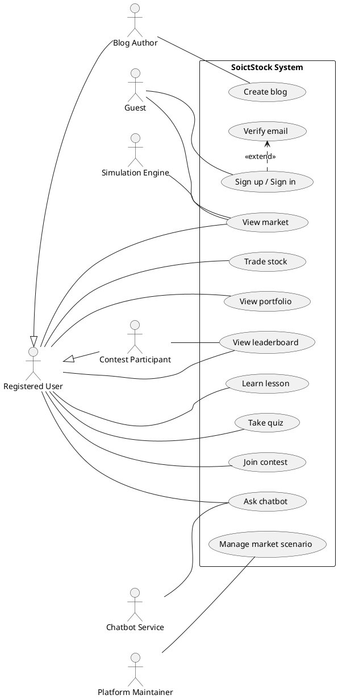
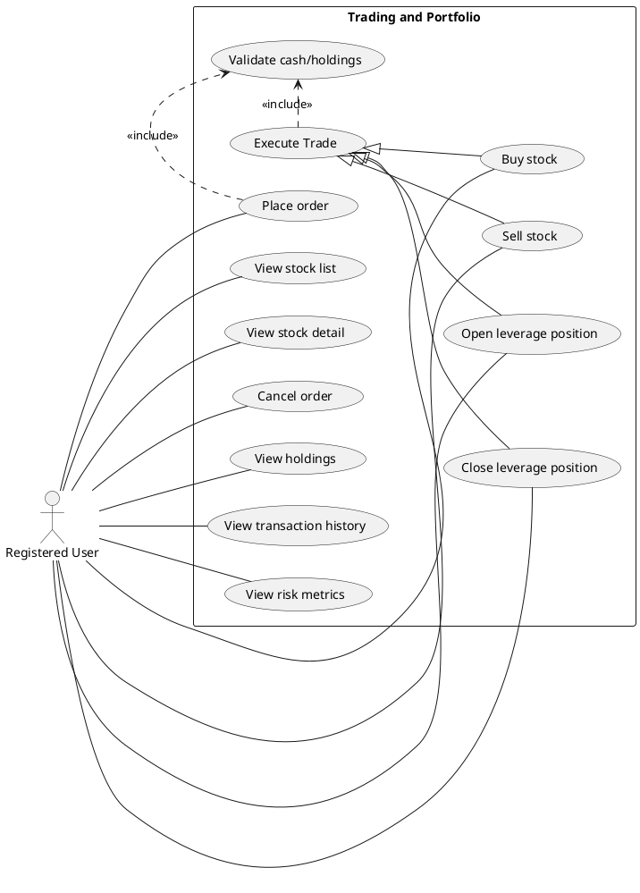
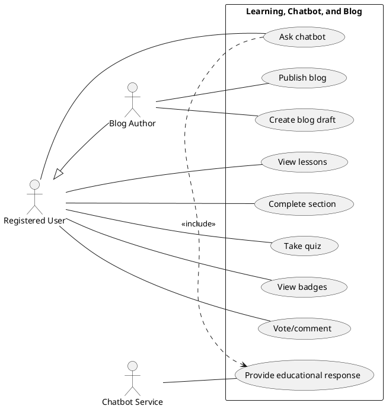
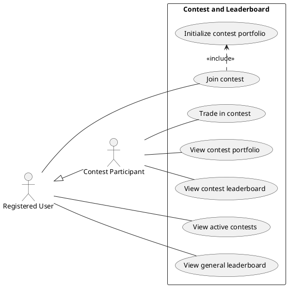

# Chapter 2. Software Requirements Specification

## 2.1 General Introduction

This chapter specifies the requirements of SoictStock from the user’s and system’s perspective. The SRS defines the main actors, use cases, functional requirements, and non-functional requirements. It also provides a basis for system design and testing.

### 2.1.1 Purpose

The purpose of SoictStock is to help users learn stock market concepts through a realistic but risk-free simulation. The system combines trading practice, portfolio tracking, educational content, chatbot support, community discussion, and competitive learning.

### 2.1.2 Definitions

| Term | Definition |
|---|---|
| Virtual stock | A simulated tradable asset representing a fictional or educational stock. |
| Virtual wallet | A simulated cash balance used for educational trading. |
| Portfolio | A collection of virtual cash, stock holdings, transactions, and performance metrics. |
| Order | A request to buy or sell a simulated stock. |
| Leverage position | A margin-based position (Long/Short) allowing users to amplify their simulated exposure. |
| Transaction | A completed trade that updates portfolio cash and holdings. |
| Tick | A generated price update in the simulated market. |
| Market scenario | A predefined market condition such as crisis or inflation that changes price behavior. |
| Learning path | A structured set of lessons, quizzes, and practice tasks. |
| Advisor | A simulated educational assistant, not a real financial advisor. |

## 2.2 System Actors

| Actor | Description |
|---|---|
| Guest | A visitor who can view landing content, public blog posts, and sign-up/sign-in options. |
| Registered user | A user who can trade simulated stocks, view portfolio, learn lessons, take quizzes, create blogs, join contests, and ask the chatbot. |
| Contest participant | A registered user who joins a contest and trades with a contest-specific portfolio. |
| Blog author | A signed-in user who creates, updates, publishes, archives, or deletes their own blog posts. |
| Platform maintainer | A person who maintains the source code, seed data, deployment configuration, and future admin functions. |
| Simulation engine | An internal system component that generates historical prices, real-time ticks, and checks liquidations. |
| News injector | An internal service that injects market news into the simulation context. |
| Chatbot service | An internal service that generates educational responses and suggestion cards based on user messages and safety rules. |

## 2.3 Main Use Cases

### 2.3.1 Guest Use Cases
* View landing page.
* Browse public blog posts.
* Sign up.
* Verify email (added).
* Sign in.

### 2.3.2 Registered User Use Cases
* View market dashboard.
* View stock chart and quote.
* Place an order.
* Execute buy/sell trade.
* Cancel an open order.
* Open leveraged position (added).
* Close leveraged position (added).
* View portfolio, risk metrics, and transaction history.
* View leaderboard.
* Join contest and trade in contest arena.
* Read lessons, complete sections, and take quizzes.
* Use market analysis lab and pattern game.
* Ask chatbot.
* Create, update, publish, archive, and delete own blog posts.
* Vote and comment on published blog posts.

### 2.3.3 Simulation Engine Use Cases
* Generate historical price bars.
* Broadcast real-time price ticks.
* Apply market regimes and scenarios.
* Update current quotes.
* Check margin liquidations (added).

## 2.4 Use Case Diagrams

Phần này bao gồm 1 overall use case và 3 level-2 use case. Các biểu đồ dưới đây được định dạng theo cấu trúc UML (PlantUML) hỗ trợ đầy đủ các quan hệ như yêu cầu: association, include, extend, generalization. Bạn có thể sử dụng plugin PlantUML trên VSCode hoặc website PlantUML để render thành hình ảnh tương tự như mẫu (có bounding box, actor ngoài, use case trong).

### Diagram 1: Overall Use Case Diagram
Mức độ: Bắt buộc.

### Diagram 2: Level-2 Use Case Diagram — Trading and Portfolio
Mức độ: Bắt buộc.

### Diagram 3: Level-2 Use Case Diagram — Learning, Chatbot, and Blog
Mức độ: Nên vẽ.

### Diagram 4: Level-2 Use Case Diagram — Contest and Leaderboard
Mức độ: Nên vẽ.

## 2.5 Use Case Specifications

### 2.5.1 UC-01: Sign Up
* **Actor**: Guest
* **Precondition**: The visitor has not signed in.
* **Main flow**: The guest opens the authentication modal, enters email, password, and display name. The backend validates the input, hashes the password, creates a user record (unverified), and initializes a portfolio with virtual cash. The system sends a verification email.
* **Alternative flow**: If the email already exists or the password is invalid, the system returns an error message.
* **Postcondition**: A new unverified account and default portfolio are created.

### 2.5.2 UC-02: Execute Buy/Sell Trade
* **Actor**: Registered user
* **Precondition**: The user is signed in and the selected ticker exists in the simulated market.
* **Main flow**: The user selects a ticker, chooses buy or sell, enters quantity, and submits the trade. The backend reads the current simulated price, validates cash or holdings, updates portfolio, records the transaction, and updates the leaderboard.
* **Alternative flow**: If cash is insufficient, holdings are insufficient, or the ticker is unknown, the trade is rejected.
* **Postcondition**: Portfolio, transaction history, and leaderboard are updated after a successful trade.

### 2.5.3 UC-03: Stream Real-time Prices
* **Actor**: Simulation engine
* **Precondition**: Backend server and WebSocket server are running.
* **Main flow**: The engine initializes historical prices, starts a tick loop, updates prices every few seconds, stores ticks, and broadcasts updates to connected frontend clients. Engine also regularly checks for margin liquidation on leveraged positions.
* **Alternative flow**: If the WebSocket connection is unavailable, the frontend may fall back to local simulation to keep the user interface responsive.
* **Postcondition**: The market dashboard receives current prices without refreshing the page, and under-margined accounts are liquidated.

### 2.5.4 UC-04: Complete Quiz
* **Actor**: Registered user
* **Precondition**: The user opens a lesson or quiz in the learning center.
* **Main flow**: The user answers quiz questions and submits the quiz. The system calculates the score, saves the quiz result, updates progress, and displays feedback.
* **Alternative flow**: If the user is not signed in, progress may not be persisted.
* **Postcondition**: Learning progress and quiz result are stored for the user.

### 2.5.5 UC-05: Publish Blog Post
* **Actor**: Blog author
* **Precondition**: The user is signed in and has created a draft post.
* **Main flow**: The author edits the title and content, saves the draft, and publishes the post. The system changes the post status to published and makes it visible on the public blog page.
* **Alternative flow**: If the user is not the owner of the post, the update, archive, publish, or delete request is rejected.
* **Postcondition**: The post is visible to public readers if it is published.

### 2.5.6 UC-06: Ask Chatbot
* **Actor**: Registered user
* **Precondition**: The chatbot widget is available.
* **Main flow**: The user enters a question. The chatbot service detects intent, applies safety rules, uses platform and learning context, returns an educational response, and saves the message history.
* **Alternative flow**: If the user asks for real investment advice, the chatbot responds with an educational disclaimer and avoids a direct buy/sell recommendation.
* **Postcondition**: The user receives guidance, and the chat history is updated.

## 2.6 Functional Requirements

### 2.6.1 FR-01 Authentication and User Profile
* FR-AUTH-1 The system shall allow users to sign up using email, password, and display name.
* FR-AUTH-2 The system shall hash passwords before storage.
* FR-AUTH-3 The system shall allow users to sign in.
* FR-AUTH-4 The system shall allow users to view and update their display name.
* FR-AUTH-5 The system shall create a default portfolio for each new user.
* FR-AUTH-6 The system shall require users to verify their email address before signing in (added).

### 2.6.2 FR-02 Market Simulation
* FR-MKT-1 The system shall maintain a list of simulated stocks.
* FR-MKT-2 The system shall generate historical price bars for each stock.
* FR-MKT-3 The system shall stream real-time price updates through WebSocket.
* FR-MKT-4 The system shall provide stock quotes and historical data through REST APIs.
* FR-MKT-5 The system shall support market scenarios and regimes.

### 2.6.3 FR-03 Trading and Order Management
* FR-TRD-1 The system shall allow users to execute buy and sell trades.
* FR-TRD-2 The system shall reject buy trades when virtual cash is insufficient.
* FR-TRD-3 The system shall reject sell trades when holdings are insufficient.
* FR-TRD-4 The system shall record each successful transaction.
* FR-TRD-5 The system shall allow users to place, view, and cancel simulated orders.
* FR-TRD-6 The system shall allow users to open leveraged long or short positions (added).
* FR-TRD-7 The system shall allow users to close leveraged positions and calculate realized PnL (added).
* FR-TRD-8 The system shall liquidate open leveraged positions when losses exceed the liquidation threshold (added).

### 2.6.4 FR-04 Portfolio Management and Risk Analytics
* FR-PRT-1 The system shall display cash balance and current holdings.
* FR-PRT-2 The system shall calculate total portfolio value.
* FR-PRT-3 The system shall calculate realized and unrealized profit/loss.
* FR-PRT-4 The system shall display transaction history.
* FR-PRT-5 The system shall calculate risk metrics such as volatility, Sharpe ratio, and maximum drawdown.

### 2.6.5 FR-05 Learning Center
* FR-LRN-1 The system shall display learning paths and lessons.
* FR-LRN-2 The system shall track completed lesson sections.
* FR-LRN-3 The system shall allow users to submit quizzes.
* FR-LRN-4 The system shall save quiz results.
* FR-LRN-5 The system shall display badges, practice tasks, pattern game, and market analysis lab activities.

### 2.6.6 FR-06 Chatbot, Advisor, Blog, Contest, and Leaderboard
* FR-SOC-1 The system shall provide a chatbot widget for educational questions and platform guidance.
* FR-SOC-2 The system shall save and clear chatbot history.
* FR-SOC-3 The system shall display advisor-oriented educational responses and mock backtest output.
* FR-SOC-4 The system shall allow signed-in users to create, publish, archive, and delete their own blog posts.
* FR-SOC-5 The system shall allow users to vote and comment on published posts.
* FR-SOC-6 The system shall display active contests and allow users to join them.
* FR-SOC-7 The system shall maintain general and contest leaderboards.

## 2.7 Non-functional Requirements

| Category | Requirement |
|---|---|
| Performance | The frontend should update displayed prices smoothly with the simulated tick interval. |
| Data integrity | Portfolio cash and holdings must not become negative after trades. |
| Reliability | If the WebSocket connection is unavailable, the frontend should continue displaying simulated movement or recover gracefully. |
| Security | Passwords must be hashed before storage. |
| Authorization | Blog editing, archiving, and deleting should be limited to the owner of the post. |
| Usability | Users should be able to navigate to Simulation, Portfolio, Learn, Blogs, Contest, and Leaderboard from the main navigation. |
| Maintainability | Simulation, order, portfolio, learning, chatbot, blog, contest, and leaderboard logic should be separated into routes, services, stores, and components. |
| Scalability | The system should allow adding more stocks, lessons, contests, and blog posts. |
| Portability | The system should run through Docker Compose or manual npm setup. |
| Ethical safety | Chatbot and advisor responses must clarify that the system is for educational simulation and not real financial advice. |
