# FINAL PROJECT REPORT

**Course:** IT3180 – Introduction to Software Engineering

# Virtual Stock Market Simulation and Consultancy Platform (SoictStock)

**Class code:** 168067  
**Instructor:** PhD. Trinh Thanh Trung

---

## CONTENTS

| Chapter | Title | Page |
|---------|-------|------|
| | Member Assignment | vi |
| 1 | Problem Survey | 1 |
| 1.1 | Problem Description | 1 |
| 1.2 | Problem Survey | 2 |
| 1.3 | Client, Users, and Stakeholders | 3 |
| 1.4 | Basic Business Information of the Problem | 4 |
| 1.5 | Business Process Diagrams and Business Function Decomposition | 7 |
| 1.6 | Simple Project Plan | 11 |
| 2 | Software Requirements Specification | 12 |
| 2.1 | General Introduction | 12 |
| 2.2 | Use Case Diagrams | 14 |
| 2.3 | Use Case Specifications | 16 |
| 2.4 | Non-Functional Requirements | 24 |
| 3 | Requirement Analysis | 26 |
| 3.1 | Identifying Analysis Classes | 26 |
| 3.2 | Sequence Diagrams | 29 |
| 3.3 | Analysis Class Diagram | 33 |
| 3.4 | Entity Relationship Diagram | 33 |
| 3.5 | Main Analysis Scenarios | 36 |
| 4 | System Design | 39 |
| 4.1 | Architecture Design | 39 |
| 4.2 | Database Design | 41 |
| 4.3 | Detailed Package Design | 44 |
| 4.4 | Detailed Class Design | 47 |
| 4.5 | Detailed Class Diagram | 49 |
| 4.6 | Interface Design | 50 |
| 5 | Demo Program Implementation | 52 |
| 5.1 | Tools and Libraries | 52 |
| 5.2 | Demo Program Results | 53 |
| 5.3 | Demo Interface Screenshots | 54 |
| 6 | System Testing | 55 |
| 6.1 | Testing Implemented Functions | 55 |
| 6.2 | Testing Non-Functional Requirements | 59 |
| 7 | Installation and User Guide | 60 |

---

# CHAPTER 1. PROBLEM SURVEY

This chapter introduces the background, motivation, and scope of the project. The project is developed for the Software Engineering course and applies software engineering principles such as requirement analysis, system design, implementation, testing, and documentation to a practical problem.

The proposed system is a **Virtual Stock Market Simulation and Consultancy Platform (SoictStock)**. The platform provides an interactive simulation environment designed to replicate the mechanics of equity trading, allowing users to execute buy and sell orders for shares of virtual companies within a risk-free setting. Furthermore, the application integrates specialized content and insights from the SoictStock consulting firm, bridging the gap between theoretical trading and professional consultancy.

## 1.1. Problem Description

Financial literacy remains a critical gap for many young people and aspiring investors. Real stock markets carry significant risk, and newcomers often lack the hands-on experience needed to understand how equity trading, price movements, and market dynamics work in practice. Existing educational tools are often too simplified (static quizzes) or too complex (professional trading terminals) to serve as effective learning environments.

The target system of this project is a **virtual stock market simulation platform** that enables users to trade virtual shares using realistic market mechanics. The system features:

- **30 virtual stocks** organized across 6 industry sectors (Technology, Healthcare, Energy, Finance, Consumer, Industrial)
- A **Geometric Brownian Motion (GBM)** pricing engine with mean reversion for realistic price behavior
- **News-driven market fluctuations** from real financial news APIs and generated fallback events
- **Real-time price streaming** via WebSocket for live market data
- **Portfolio management** with P&L tracking, risk metrics (Sharpe ratio, max drawdown, volatility)
- **AI Consultancy advisor** providing strategy recommendations
- An **educational learning module** with lessons, quizzes, and interactive labs

Within the scope of this course project, the implemented version is a **full-stack web application** with a Node.js/Express backend, React (Vite) frontend, and MongoDB database. The simulation runs in real-time with prices updated every 3 seconds and 90 days of pre-generated historical data per stock.

## 1.2. Problem Survey

A survey of the target problem reveals that most aspiring investors face a significant barrier: the fear of financial loss in real markets. While theoretical knowledge about stocks can be acquired through books and courses, practical trading skills—such as reading charts, managing risk, timing entries/exits, and understanding market psychology—require hands-on experience that traditional education cannot provide.

**Existing Solutions and Their Limitations:**

| Solution | Limitation |
|----------|-----------|
| Paper trading (e.g., Investopedia Simulator) | Delayed data, no real-time feel, limited educational content |
| Real brokerage demo accounts | Complex UI, no educational guidance, intimidating for beginners |
| Stock market games | Oversimplified, lack realistic pricing models |
| Financial education apps | Text-heavy, no interactive trading practice |

The main business need is to create a **risk-free, educationally rich trading environment** that combines realistic market simulation with guided learning. The platform must implement a sophisticated pricing algorithm governed by realistic market rules—such as volatility, news-driven fluctuations, and supply-demand dynamics—that mirror the behavior of real-world stock exchanges.

The planned project environment is a **modern web application**. The user interface is implemented with **React.js (Vite)** with **Zustand** for state management. The backend uses **Node.js/Express** with **WebSocket** for real-time data streaming. **MongoDB** is used for persistent data storage with the native MongoDB driver.

## 1.3. Client, Users, and Stakeholders

| Role | Description |
|------|-------------|
| **Client** | |
| Instructor | Provides the project topic, gives feedback, and evaluates the final demo and report. |
| **Users** | |
| Trader (Student) | Executes trades (buy/sell), manages virtual portfolio, views market data, tracks performance, and learns about stock market concepts. |
| Learner | Uses the educational modules (lessons, quizzes, interactive labs) to build financial literacy without necessarily trading. |
| **Stakeholders** | |
| SoictStock Consulting Firm | Represents the advisory brand; provides curated market strategies and professional insights integrated into the platform. |
| Academic Institution (HUST) | Evaluates the project as a Software Engineering course deliverable. |
| Development Team | Designs, implements, tests, and documents the system within the course project scope. |

## 1.4. Basic Business Information of the Problem

**Business Process 1: User Registration and Authentication**

| Input | Process | Output |
|-------|---------|--------|
| Email, password, display name | Validate email uniqueness; hash password with bcryptjs; create user record and initialize portfolio with $150,000 virtual cash | User account; default portfolio; session state |

**Business Process 2: Market Simulation and Price Generation**

| Input | Process | Output |
|-------|---------|--------|
| Stock definitions (30 tickers, base prices, drift, volatility); simulation parameters | Initialize: generate 90 days of 5-min historical ticks via GBM with mean reversion; Runtime: generate new tick every 3 seconds for all stocks; persist to MongoDB `ticks` collection | Real-time price updates; historical tick data for charting; WebSocket broadcast |

**Business Process 3: Order Execution and Portfolio Management**

| Input | Process | Output |
|-------|---------|--------|
| Trade order (ticker, type, quantity, order type); current prices | Validate funds/shares; execute Market orders immediately with slippage; store Limit/Stop orders as Pending; update portfolio holdings, cash, and average cost basis; record transaction | Updated portfolio; transaction history; leaderboard update |

**Business Process 4: News Injection and Market Impact**

| Input | Process | Output |
|-------|---------|--------|
| Real news articles from GNews API; fallback news templates | Fetch news periodically; analyze headlines with keyword-based NLP to determine affected sectors, sentiment, and impact magnitude; apply price shocks to affected stocks | News feed; price adjustments (±8% capped); sentiment labels |

**Business Process 5: Dashboard Visualization and Advisory**

| Input | Process | Output |
|-------|---------|--------|
| Portfolio data; market prices; tick history; risk calculations | Display real-time charts (candlestick via lightweight-charts), portfolio allocations (recharts), P&L summaries, risk metrics; AI advisor provides strategy-specific recommendations | Interactive dashboard; AI-generated trading advice; performance leaderboard |

## 1.5. Business Process Diagrams and Business Function Decomposition

### Activity Diagram: Market Simulation Lifecycle

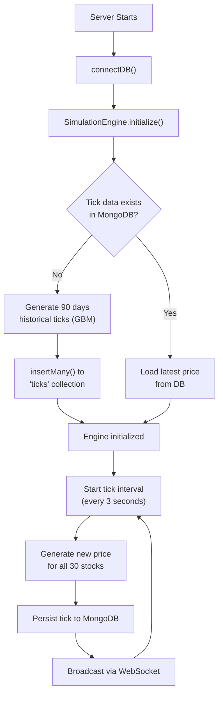

### Activity Diagram: Trading Workflow

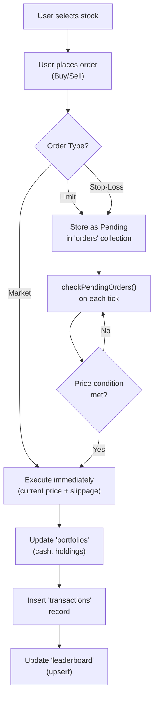

### Business Function Decomposition Table

| No. | Business Function | Description | Implementation Status |
|-----|------------------|-------------|----------------------|
| **1** | **User Authentication** | Manages user registration, login, and profile management. | Implemented |
| 1.1 | Sign Up | Register with email, password, display name. Initialize portfolio with $150,000. | Implemented |
| 1.2 | Sign In | Authenticate via email/password using bcryptjs. | Implemented |
| 1.3 | Profile Management | View and update display name. | Implemented |
| **2** | **Market Simulation** | Core price simulation engine using GBM with mean reversion. | Implemented |
| 2.1 | Historical Data Generation | Generate 90 days × 78 bars/day of 5-min tick data per stock. | Implemented |
| 2.2 | Real-time Tick Generation | Generate new price every 3 seconds for all 30 stocks. | Implemented |
| 2.3 | Market Regime (Scenarios) | Apply historical crisis scenarios (2008, COVID, Tech Bubble, Inflation). | Implemented |
| 2.4 | Price Clamping | Safety net: prices clamped ±60% from base price. | Implemented |
| **3** | **Trading System** | Full order book with Market, Limit, and Stop-Loss orders. | Implemented |
| 3.1 | Market Order Execution | Immediate execution with bid/ask spread and slippage modeling. | Implemented |
| 3.2 | Limit/Stop Order Management | Persist pending orders; auto-execute when price conditions met. | Implemented |
| 3.3 | Order Cancellation | Cancel pending limit/stop orders. | Implemented |
| **4** | **Portfolio Management** | Track holdings, cash, P&L, and portfolio value over time. | Implemented |
| 4.1 | Portfolio Valuation | Calculate total value = cash + Σ(shares × current price). | Implemented |
| 4.2 | Unrealized P&L | Track per-holding gain/loss vs average cost basis. | Implemented |
| 4.3 | Transaction History | Record all executed trades with timestamps. | Implemented |
| 4.4 | Portfolio Snapshots | Capture portfolio value every 30 seconds for performance charting. | Implemented |
| **5** | **Risk Analytics** | Financial risk metrics for portfolio evaluation. | Implemented |
| 5.1 | Sharpe Ratio | Risk-adjusted return metric (annualized). | Implemented |
| 5.2 | Maximum Drawdown | Peak-to-trough decline measurement. | Implemented |
| 5.3 | Volatility | Standard deviation of returns (annualized). | Implemented |
| 5.4 | Beta | Portfolio sensitivity relative to market. | Implemented |
| 5.5 | Win Rate & Profit Factor | Trade-level performance metrics. | Implemented |
| **6** | **News System** | Real and generated financial news that impacts stock prices. | Implemented |
| 6.1 | Real News Fetch | Fetch from GNews API with rate limiting (10-min cache). | Implemented |
| 6.2 | Headline Analysis | Keyword-based NLP for sector, sentiment, and impact. | Implemented |
| 6.3 | Fallback News Generation | Template-based news (earnings, Fed, mergers, black swan events). | Implemented |
| 6.4 | Price Shock Application | Apply impact (±8% capped) to affected stock prices. | Implemented |
| **7** | **AI Advisory** | Strategy-based trading consultation. | Implemented |
| 7.1 | Trend Following Advice | Momentum-based recommendations with RSI/SMA analysis. | Implemented |
| 7.2 | Mean Reversion Advice | Oversold/overbought detection with reversion strategies. | Implemented |
| 7.3 | Value Investing Advice | Valuation-based long-term accumulation recommendations. | Implemented |
| 7.4 | Strategy Backtesting | Simulated backtest with equity curve generation. | Implemented |
| **8** | **Educational Module** | Interactive learning content for financial literacy. | Implemented |
| 8.1 | Lessons | Structured lessons on market fundamentals. | Implemented |
| 8.2 | Quizzes | Knowledge assessment modules. | Implemented |
| 8.3 | Pattern Recognition Game | Interactive chart pattern identification. | Implemented |
| 8.4 | Market Analysis Lab | Hands-on technical analysis practice. | Implemented |
| **9** | **Leaderboard** | Competitive ranking of traders by portfolio performance. | Implemented |
| **10** | **Real-time Data Streaming** | WebSocket-based live price broadcasting. | Implemented |

## 1.6. Simple Project Plan

| No. | Task | Estimated Time (weeks) | People |
|-----|------|----------------------|--------|
| 1 | Project survey, scope definition, feasibility analysis, and team planning. | 1 | 6 |
| 2 | Requirement analysis, actor identification, use case modeling, and main workflow design. | 1 | 6 |
| 3 | System architecture, database schema, API design, frontend structure, and simulation engine design. | 1 | 6 |
| 4 | Backend implementation: Express server, authentication, market simulation engine, order book, news injector, risk metrics, portfolio, leaderboard APIs. | 2 | 4 |
| 5 | Frontend implementation: React dashboard UI, simulation page, portfolio page, leaderboard, learning module, chart components, WebSocket integration. | 3 | 3 |
| 6 | Simulation engine tuning: GBM parameters, mean reversion, scenario calibration, news impact balancing. | 1 | 2 |
| 7 | System integration, end-to-end testing, API testing, and bug fixing. | 2 | 6 |
| 8 | Final report, diagrams, screenshots, user guide, presentation slides, and demo rehearsal. | 2 | 6 |

---

# CHAPTER 2. SOFTWARE REQUIREMENTS SPECIFICATION

## 2.1. General Introduction

### 2.1.1. System Actors

| No. | Actor | Description |
|-----|-------|-------------|
| 1 | **Trader (Student)** | Primary user who registers, logs in, executes trades (buy/sell), manages portfolio, views real-time market data and charts, tracks performance with risk metrics, interacts with the AI advisor, and competes on the leaderboard. |
| 2 | **Learner** | Education-oriented user who accesses lessons, quizzes, pattern recognition games, and market analysis labs to build financial literacy. A Learner may also be a Trader. |
| 3 | **System (Simulation Engine)** | Internal automated actor that generates prices, injects news, applies market shocks, checks pending orders, and broadcasts data via WebSocket. |

### 2.1.2. Supporting System Elements

| No. | Element | Description |
|-----|---------|-------------|
| 1 | **SimulationEngine** | Core GBM-based price generation engine. Generates historical data on first run, produces real-time ticks every 3s, supports regime switching (crisis scenarios), and applies news-driven shocks. |
| 2 | **OrderBookService** | Manages Market, Limit, and Stop-Loss orders. Executes market orders immediately with slippage; stores limit/stop orders as pending; auto-fills when price conditions are met. |
| 3 | **NewsInjector + NewsService** | Fetches real financial news from GNews API, analyzes headlines using keyword-based NLP, determines affected sectors/tickers, and applies price impacts. Falls back to template-based generated news. |
| 4 | **RiskMetrics** | Computes portfolio risk analytics: Sharpe ratio, max drawdown, volatility, beta, win rate, and profit factor. |
| 5 | **MongoDB Database** | Persistent storage for ticks, stocks, orders, transactions, portfolios, portfolio_snapshots, leaderboard, news, and users (9 collections). |
| 6 | **WebSocket Server** | Real-time bidirectional communication for price streaming (`ws://host/ws`). Sends `init` payload (full history) on connect, then `tick` updates every 3s. |

### 2.1.3. Main Use Cases

| No. | Code | Use Case | Description | Actor |
|-----|------|----------|-------------|-------|
| 1 | UC-01 | Register Account | Create a new account with email, password, display name. System initializes $150,000 virtual portfolio. | Trader |
| 2 | UC-02 | Login | Authenticate with email/password. Load user portfolio and orders. | Trader, Learner |
| 3 | UC-03 | View Market Data | View real-time stock prices, charts (candlestick/line), order book depth, and bid/ask quotes. | Trader |
| 4 | UC-04 | Execute Trade | Place buy/sell orders (Market, Limit, Stop-Loss). System validates funds/shares and executes or queues. | Trader |
| 5 | UC-05 | Manage Portfolio | View holdings, unrealized P&L, cash balance, total portfolio value, transaction history, and risk metrics. | Trader |
| 6 | UC-06 | View Leaderboard | View ranked list of top traders by portfolio value, return %, Sharpe ratio, and trade count. | Trader |
| 7 | UC-07 | Chat with AI Advisor | Select a strategy mode (Trend/Mean Reversion/Value) and receive context-aware trading recommendations. | Trader |
| 8 | UC-08 | Run Backtest | Configure a strategy, ticker, timeframe, and capital; receive simulated backtest results with equity curve. | Trader |
| 9 | UC-09 | View News Feed | View financial news (real + generated) with sentiment labels and affected ticker tags. | Trader |
| 10 | UC-10 | Activate Scenario | Activate a historical market scenario (2008 Crisis, COVID, Tech Bubble, Inflation) that modifies drift and volatility. | Trader |
| 11 | UC-11 | Learn Financial Concepts | Access lessons, quizzes, pattern recognition games, and market analysis labs. | Learner |
| 12 | UC-12 | Update Profile | Change display name. | Trader, Learner |

## 2.2. Use Case Diagrams

### 2.2.1. Overall Use Case Diagram

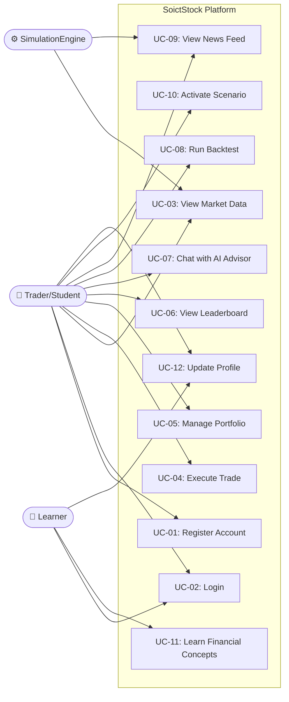

## 2.3. Use Case Specifications

### 2.3.1. Use Case UC-01: Register Account

| Item | Description |
|------|-------------|
| Use case code | UC-01 |
| Use case name | Register Account |
| Actor | Trader |
| Description | Allows a new user to create an account with email, password, and optional display name. The system validates email uniqueness, hashes the password, creates the user record, and initializes a portfolio with $150,000 virtual cash. |
| Precondition | The user does not have an existing account. |
| Main flow | 1. User opens the registration form. 2. User enters email, password (≥6 chars), and optional display name. 3. User submits the form. 4. System checks if email already exists. 5. System hashes password with bcryptjs (10 rounds). 6. System creates user document in `users` collection. 7. System creates portfolio document in `portfolios` collection with `cash: 150000`. 8. System returns user profile (excluding password hash). |
| Alternative flow | 1. If email already exists → return 409 Conflict error. 2. If password < 6 characters → return 400 error. 3. If email or password missing → return 400 error. |
| Postcondition | User account is created; portfolio is initialized; user can log in. |

### 2.3.2. Use Case UC-02: Login

| Item | Description |
|------|-------------|
| Use case code | UC-02 |
| Use case name | Login |
| Actor | Trader, Learner |
| Description | Authenticates users with email and password. On success, returns user profile and updates last login timestamp. |
| Precondition | User account exists. |
| Main flow | 1. User opens the login form. 2. User enters email and password. 3. System finds user by email (case-insensitive). 4. System compares password hash with bcrypt. 5. System updates `lastLoginAt` field. 6. System returns user profile. 7. Frontend stores user state and loads portfolio/orders. |
| Alternative flow | 1. If email/password missing → 400 error. 2. If user not found → 401 "Invalid email or password". 3. If password mismatch → 401 "Invalid email or password". |
| Postcondition | User is authenticated; frontend loads personalized data. |

### 2.3.3. Use Case UC-03: View Market Data

| Item | Description |
|------|-------------|
| Use case code | UC-03 |
| Use case name | View Market Data |
| Actor | Trader, SimulationEngine |
| Description | Displays real-time stock prices, interactive candlestick/line charts, order book depth (10-level bid/ask), and stock quotes (price, bid, ask, spread). Data streams via WebSocket in real-time. |
| Precondition | WebSocket connection is established; simulation engine is running. |
| Main flow | 1. User opens the Simulation page. 2. Frontend connects to `ws://host/ws`. 3. Server sends `init` message with full tick history for all 30 stocks. 4. Frontend renders candlestick chart with historical data. 5. Every 3 seconds, server sends `tick` message with new prices. 6. Chart and watchlist update in real-time. 7. User selects a stock to view detailed chart and order book. |
| Alternative flow | 1. If WebSocket disconnects → frontend falls back to local simulation via `simulateTick()`. 2. If ticker not found → 404 error on quote endpoint. |
| Postcondition | User can monitor all 30 stocks in real-time with interactive charts. |

### 2.3.4. Use Case UC-04: Execute Trade

| Item | Description |
|------|-------------|
| Use case code | UC-04 |
| Use case name | Execute Trade |
| Actor | Trader |
| Description | Allows the user to place buy/sell orders. Supports Market (immediate), Limit (trigger at price), and Stop-Loss (trigger below price) order types. |
| Precondition | User is logged in with a funded portfolio. |
| Main flow | 1. User selects a stock from the watchlist. 2. User chooses order type (Market/Limit/Stop-Loss) and side (Buy/Sell). 3. User enters quantity (and price for Limit/Stop). 4. User submits the order. 5. **Market order:** System executes immediately at current ask/bid + slippage. Records in `orders` and `transactions`. Updates `portfolios` (cash, holdings). Updates `leaderboard`. 6. **Limit/Stop order:** System stores as Pending in `orders`. `checkPendingOrders()` evaluates on each tick. When condition met, fills the order. |
| Alternative flow | 1. If insufficient funds (Buy) → 400 "Insufficient funds". 2. If insufficient shares (Sell) → 400 "Insufficient shares". 3. If unknown ticker → 404 error. 4. User can cancel pending orders. |
| Postcondition | Order is executed or queued; portfolio and leaderboard updated. |

### 2.3.5. Use Case UC-05: Manage Portfolio

| Item | Description |
|------|-------------|
| Use case code | UC-05 |
| Use case name | Manage Portfolio |
| Actor | Trader |
| Description | View portfolio dashboard with cash balance, total value, holdings with unrealized P&L, transaction history, risk metrics (Sharpe, drawdown, volatility), and portfolio value chart over time. |
| Precondition | User is logged in. |
| Main flow | 1. User navigates to the Portfolio page. 2. System fetches portfolio from `portfolios` collection. 3. System calculates total value (cash + market value of holdings). 4. System calculates unrealized P&L per holding. 5. System loads recent transactions (limit 50). 6. System renders allocation donut chart, performance sparklines, and risk metrics. 7. Portfolio snapshots are recorded every 30 seconds for history charting. |
| Alternative flow | If portfolio doesn't exist (new user), system creates default with $150,000. |
| Postcondition | User can monitor portfolio performance and risk profile. |

### 2.3.6. Use Case UC-06: View Leaderboard

| Item | Description |
|------|-------------|
| Use case code | UC-06 |
| Use case name | View Leaderboard |
| Actor | Trader |
| Description | View ranked list of top 20 traders sorted by portfolio value. Displays rank, name, portfolio value, total return %, Sharpe ratio, and trade count. |
| Precondition | User is logged in. |
| Main flow | 1. User navigates to the Leaderboard page. 2. System queries `leaderboard` collection sorted by `portfolioValue` desc. 3. If no entries exist, system returns mock demo data. 4. Frontend renders ranked table with medal icons for top 3. |
| Postcondition | User can compare performance against other traders. |

### 2.3.7. Use Case UC-07: Chat with AI Advisor

| Item | Description |
|------|-------------|
| Use case code | UC-07 |
| Use case name | Chat with AI Advisor |
| Actor | Trader |
| Description | Interact with an AI-powered financial advisor that provides strategy-specific trading recommendations including rationale and risk assessment. |
| Precondition | User is on the Simulation page. |
| Main flow | 1. User opens the AI Chat panel. 2. User selects a strategy mode (Trend Following, Mean Reversion, Value Investing). 3. User sends a query message. 4. System generates a context-aware recommendation with recommendation text, rationale, and risk assessment. 5. Response is displayed in chat format. |
| Postcondition | User receives actionable trading advice. |

### 2.3.8. Use Case UC-10: Activate Scenario

| Item | Description |
|------|-------------|
| Use case code | UC-10 |
| Use case name | Activate Scenario |
| Actor | Trader |
| Description | Activate a predefined historical market scenario that adjusts drift and volatility parameters across all stocks to simulate real-world crisis/boom conditions. |
| Precondition | User is on the Simulation page. |
| Main flow | 1. User selects a scenario (2008 Financial Crisis / Tech Bubble / COVID March 2020 / High Inflation). 2. System calls `/api/scenarios/:id/activate`. 3. SimulationEngine updates regime with new drift overrides and volatility multipliers. 4. Prices begin reflecting the new market conditions. |
| Alternative flow | User can deactivate scenario → engine returns to "normal" regime. |
| Postcondition | Market simulation reflects the selected historical conditions. |

**Scenario Parameters:**

| Scenario | Drift Override | Volatility Multiplier |
|----------|---------------|----------------------|
| 2008 Financial Crisis | −0.003 | 2.5× |
| 2000 Tech Bubble | +0.004 | 1.5× |
| COVID March 2020 | −0.008 | 4.0× |
| High Inflation | −0.0005 | 1.3× |

## 2.4. Non-Functional Requirements

### Functionality
- The system shall support user registration and authentication with hashed passwords.
- All database operations shall include error-handling mechanisms.
- The system shall implement realistic market simulation using Geometric Brownian Motion with mean reversion.
- Price shocks from news events shall be capped at ±8% to prevent unrealistic swings.
- Portfolio initialization shall start all users with $150,000 virtual cash.

### Usability
- The interface shall use modern web design with dark theme, smooth gradients, and micro-animations.
- Real-time data shall update without page refresh via WebSocket streaming.
- Charts shall be interactive with zoom, pan, and timeframe selection (1D, 1W, 1M, 3M, 1Y, All).
- Error messages shall clearly indicate the cause of failure.

### Performance
- Price ticks shall be generated and broadcast every 3 seconds with low latency.
- Historical tick data queries (up to 26,000 ticks) shall complete within acceptable response time.
- Initial tick data generation (90 days × 30 stocks) shall complete during server startup.
- WebSocket `init` payload shall deliver full history for all stocks on client connection.

### Reliability
- The system shall handle WebSocket disconnection gracefully with fallback to local simulation.
- MongoDB connection shall use singleton pattern to prevent connection leaks.
- Bulk tick insertions shall use `{ ordered: false }` to tolerate individual insert failures.
- Duplicate news insertions shall be silently ignored (error code 11000).

### Maintainability
- The system shall separate concerns: services (domain logic), routes (controllers), stores (frontend state), and components (UI).
- The simulation engine shall be configurable through stock definitions (drift, volatility, base price).
- The pricing model shall be modular and replaceable.

### Technical Constraints
- **Frontend:** React 19 + Vite 8 + Zustand 5 + React Router 7 + lightweight-charts + recharts
- **Backend:** Node.js + Express 4 + MongoDB Driver 7 + WebSocket (ws) + bcryptjs + dotenv
- **Database:** MongoDB 7 (Docker) or MongoDB Atlas
- **Deployment:** Docker Compose with 3 services (mongodb, backend, frontend/nginx)

---

# CHAPTER 3. REQUIREMENT ANALYSIS

## 3.1. Identifying Analysis Classes

The analysis model separates the system into three types of classes: **boundary classes** (UI), **control classes** (business logic), and **entity classes** (persistent data).

### Main Boundary Classes

| Boundary Class | Responsibility |
|---------------|---------------|
| LandingPage | Provides the public homepage with platform introduction, feature highlights, and navigation to registration/login. |
| AuthModal | Provides login and registration forms with form validation and error display. |
| SimulationPage | Main trading interface combining chart, watchlist, order form, order book, news panel, AI chat, portfolio panel, and scenario selector. |
| PortfolioPage | Displays portfolio overview with holdings table, allocation donut chart, transaction history, risk metrics, and performance chart. |
| LeaderboardPage | Displays ranked trader table with performance metrics. |
| LearnPage | Educational hub with lesson cards, quiz modules, pattern recognition game, and market analysis lab. |
| Navbar | Persistent navigation bar with logo, page links, and user menu. |
| Footer | Footer with SoictStock branding and links. |

### Main Control Classes

| Control Class | Responsibility |
|--------------|---------------|
| SimulationEngine | Core price generation engine using GBM. Manages stock prices, regime switching, news shocks, and tick broadcasting. |
| OrderBookService | Handles order placement, market execution with slippage, pending order checking, order cancellation, and order queries. |
| NewsInjector | Coordinates real news fetching, headline analysis, fallback generation, price shock application, and news persistence. |
| NewsService | External API communication with GNews; headline NLP analysis using keyword-sector mapping. |
| RiskMetrics | Computes Sharpe ratio, max drawdown, volatility, beta, win rate, and profit factor. |
| AuthController (auth.js routes) | Handles signup, signin, profile retrieval, and profile update. |
| PortfolioController (portfolio.js routes) | Handles portfolio loading, trade execution, history, and risk calculation. |
| MarketController (market.js routes) | Handles stock listing, tick history queries, and quote retrieval. |

### Main Entity Classes

| Entity Class | Responsibility |
|-------------|---------------|
| User | Stores user account: `_id`, `email`, `passwordHash`, `display_name`, `createdAt`, `lastLoginAt`. |
| Stock | Stores stock definition: `ticker`, `name`, `fullName`, `sector`, `color`, `basePrice`, `drift`, `volatility`. |
| Tick | Stores price data point: `ticker`, `time`, `price`, `volume`. |
| Order | Stores trading order: `id`, `userId`, `ticker`, `type`, `orderType`, `quantity`, `price`, `status`, timestamps. |
| Transaction | Stores executed trade: `userId`, `type`, `ticker`, `orderType`, `quantity`, `price`, `total`, `status`, `createdAt`. |
| Portfolio | Stores user portfolio: `userId`, `cash`, `initialCash`, `holdings` (map of ticker → {shares, avgPrice, realizedPL}). |
| PortfolioSnapshot | Stores periodic portfolio value for charting: `userId`, `value`, `createdAt`. |
| LeaderboardEntry | Stores ranking: `userId`, `portfolioValue`, `totalReturn`, `trades`, `updatedAt`. |
| NewsItem | Stores news article: `id`, `headline`, `description`, `source`, `sentiment`, `affectedTickers`, `impact`, `timestamp`. |

## 3.2. Sequence Diagrams

### Sequence Diagram: User Registration

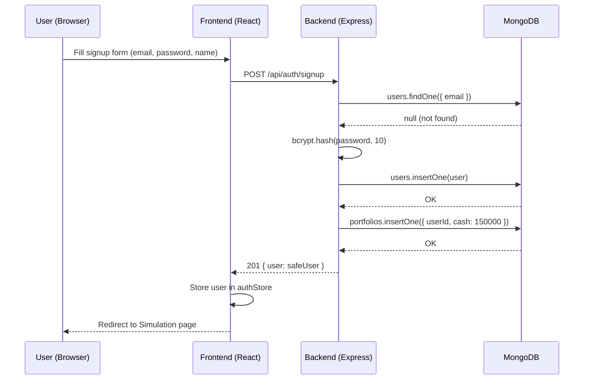

### Sequence Diagram: Market Simulation Tick

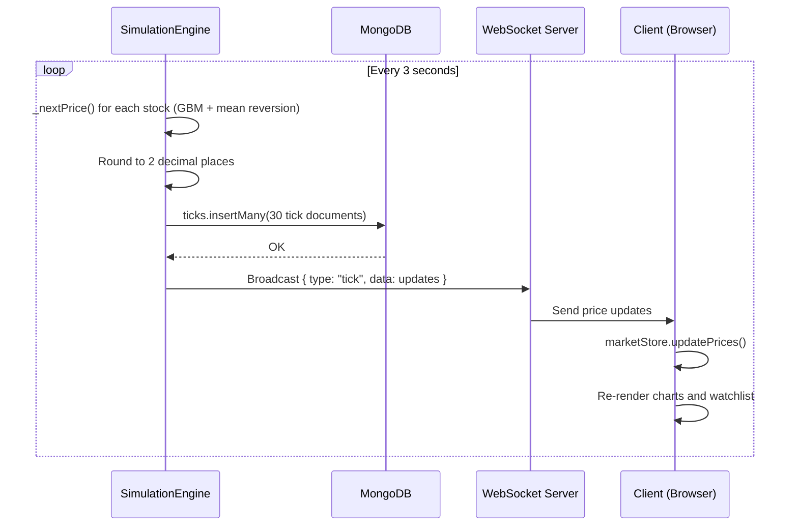

### Sequence Diagram: Trade Execution (Market Order)

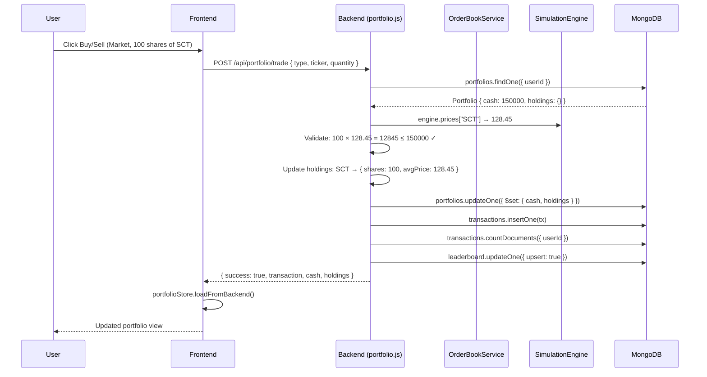

### Sequence Diagram: News Injection

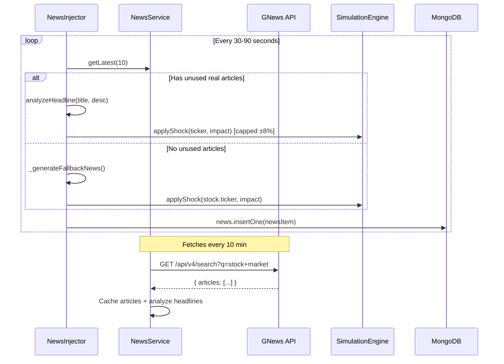

### Sequence Diagram: WebSocket Connection

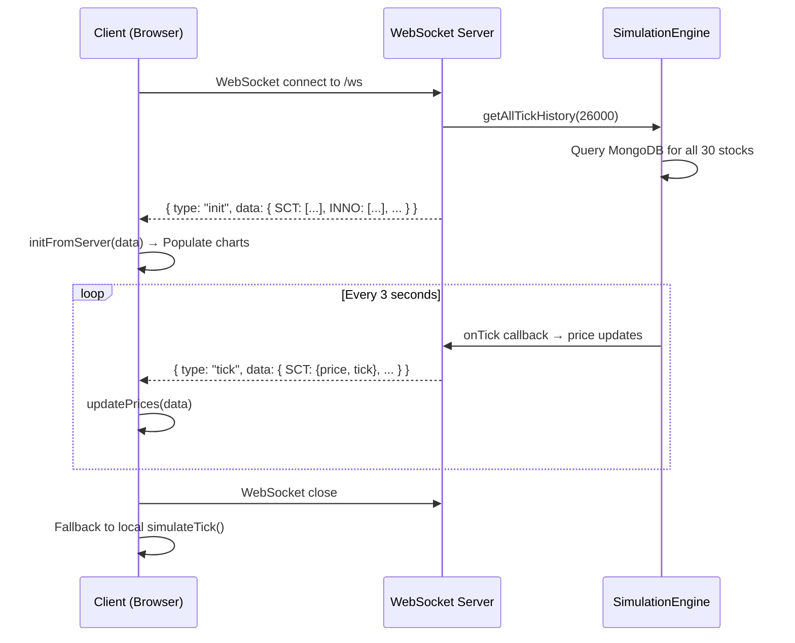

## 3.3. Analysis Class Diagram

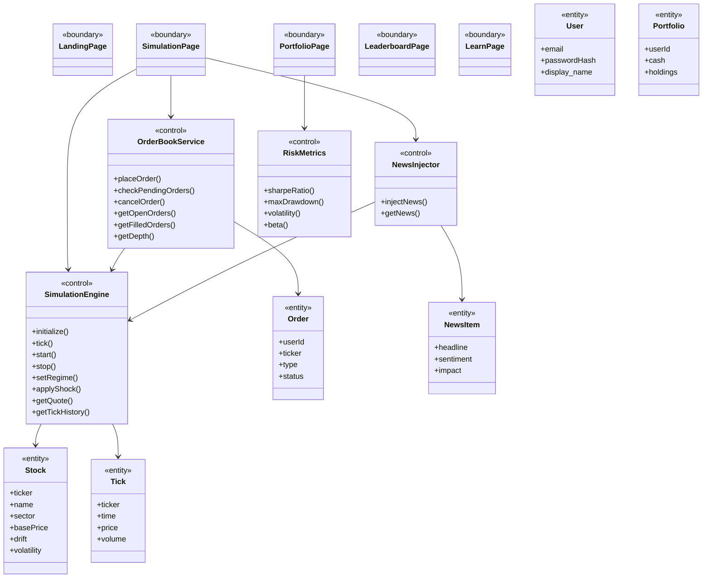

## 3.4. Entity Relationship Diagram

### Identified Data Entities

| Entity | Description |
|--------|-------------|
| User | Stores user account information, password hash, display name, and timestamps. |
| Portfolio | Stores user's virtual portfolio: cash balance, initial capital, and holdings map. |
| Transaction | Records executed trades with type, ticker, quantity, price, and total cost. |
| Order | Stores pending and completed trading orders with status tracking. |
| Tick | Stores time-series price data for all stocks (highest volume collection). |
| Stock | Stores stock metadata: ticker, name, sector, base price, simulation parameters. |
| NewsItem | Stores injected news articles with sentiment analysis and impact data. |
| PortfolioSnapshot | Periodic captures of portfolio total value for performance charting. |
| LeaderboardEntry | Aggregated ranking data: portfolio value, return %, trade count. |

### Entity Relationship Description

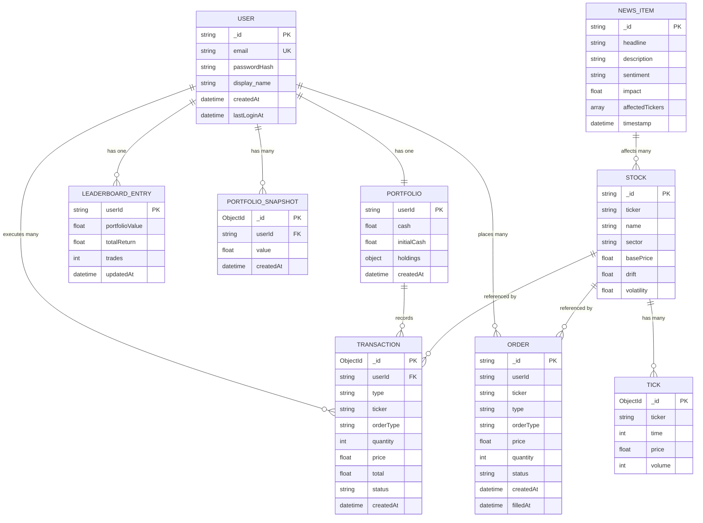

## 3.5. Main Analysis Scenarios

### Scenario 1: User Registration and First Trade
A new user visits SoictStock, creates an account with email and password. The system initializes a portfolio with $150,000 virtual cash. The user navigates to the Simulation page, connects via WebSocket, and sees real-time charts for 30 stocks. The user selects "SCT" from the watchlist, places a Market Buy order for 100 shares. The system validates sufficient funds, executes at current ask price + slippage, updates the portfolio (deducting cash, adding holdings), records the transaction, and updates the leaderboard.

### Scenario 2: Limit Order Execution
A trader places a Limit Buy order for HEAL at $75.00 (current price $78.30). The order is stored as "Pending" in the orders collection. Over the next few minutes, as the simulation engine generates new ticks, `checkPendingOrders()` evaluates: when HEAL price drops to $75.00 or below, the order is automatically filled. The portfolio, transactions, and leaderboard are updated accordingly.

### Scenario 3: News-Driven Market Movement
The NewsInjector fetches a real news article: "Federal Reserve Raises Interest Rates by 25 Basis Points." The headline analysis identifies it as Finance-sector, negative sentiment, with market-wide impact. The system applies a −2% to −5% price shock across all stocks (50% of impact for market-wide events). Traders see the news in their feed with a "negative" sentiment badge and watch their portfolio values fluctuate.

### Scenario 4: Crisis Scenario Simulation
A trader activates the "COVID March 2020" scenario. The SimulationEngine switches regime: drift override = −0.008, volatility multiplier = 4.0×. Prices begin dropping rapidly with extreme volatility. The trader can practice crisis management strategies (hedging, stop-losses) in a risk-free environment. When done, the trader deactivates the scenario to return to normal market conditions.

### Scenario 5: Portfolio Performance Analysis
A trader has been trading for several sessions. They navigate to the Portfolio page to review performance. The system calculates: total portfolio value (cash + holdings), unrealized P&L per holding, total return %. The RiskMetrics service computes Sharpe ratio (from portfolio snapshots), maximum drawdown, and portfolio volatility. The trader uses the allocation donut chart to assess diversification across sectors.

### Scenario 6: AI Advisory Consultation
A trader is unsure about their next move. They open the AI Chat panel and select "Mean Reversion" strategy mode. The advisor analyzes current market conditions and recommends: "HEAL appears oversold with RSI below 30. Consider a small position anticipating a bounce back to the mean." The advice includes rationale (price 8% below 20-day average, declining sell volume) and risk assessment (60% win rate, tight 2% stop-loss suggested).

### Scenario 7: Educational Learning Flow
A learner navigates to the Learn page. They start with a lesson card on "Understanding Bull and Bear Markets." After reading, they take a quiz to test comprehension. Next, they play the Pattern Recognition Game, identifying chart formations (Head & Shoulders, Double Bottom). Finally, they enter the Market Analysis Lab for hands-on practice with technical indicators on live simulated data.

---

# CHAPTER 4. SYSTEM DESIGN

## 4.1. Architecture Design

### 4.1.1. Selected Architecture

SoictStock is designed as a **modular client-server application** with real-time data streaming. The architecture separates the user interface, business logic/API layer, simulation engine, and persistent storage to support maintainability, testability, and future extension.

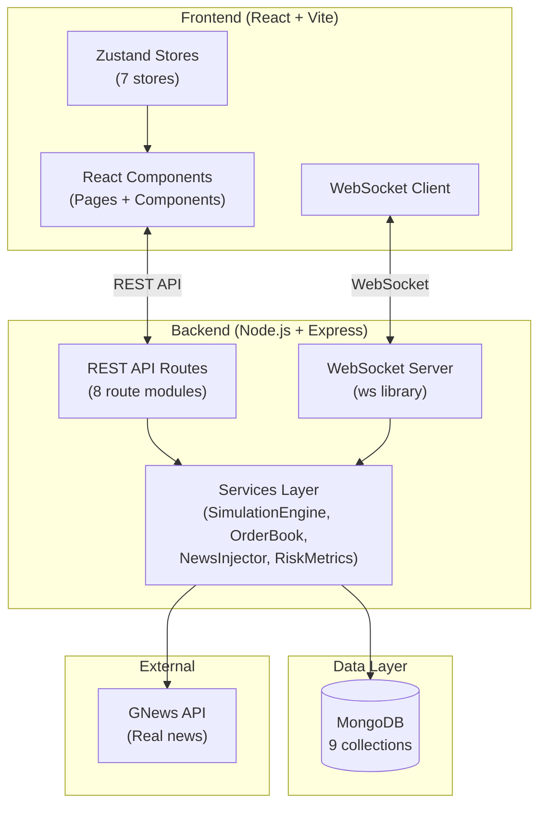

### 4.1.2. Main Components

| Component | Responsibility |
|-----------|---------------|
| **Authentication module** | Handles signup, signin, password hashing (bcryptjs), profile management. No JWT tokens — uses client-side user state. |
| **Simulation Engine** | Core GBM price generator with mean reversion. Manages 30 stocks, generates historical and real-time ticks, supports regime switching (crisis scenarios), and broadcasts via WebSocket. |
| **Order Book Service** | Manages Market/Limit/Stop-Loss orders. Market orders execute immediately with spread + slippage. Limit/Stop orders are stored as Pending and checked on each tick. |
| **News Injector + Service** | Fetches real financial news (GNews API), analyzes headlines for sector/sentiment/impact using keyword matching, applies price shocks, persists to MongoDB. Falls back to template-based generation. |
| **Risk Metrics** | Computes Sharpe ratio, max drawdown, volatility, beta, win rate, profit factor from portfolio snapshot history. |
| **Portfolio Management** | Handles portfolio CRUD, trade execution with cash/holdings updates, transaction recording, portfolio snapshots, and leaderboard updates. |
| **WebSocket Price Stream** | Sends initial full history payload on connect; broadcasts tick updates every 3s to all connected clients. |
| **Scenario Engine** | 4 predefined historical market scenarios with drift and volatility parameter overrides. |
| **AI Advisor** | Strategy-based consultation (Trend/Mean Reversion/Value) and backtesting with equity curve generation. |
| **Educational Module** | Lessons, quizzes, pattern recognition games, and market analysis labs. |

## 4.2. Database Design

SoictStock uses **MongoDB** (NoSQL document database) with the **native MongoDB driver** (no Mongoose). Database name: `soict_stock`.

### 4.2.1. Collection: `users`

| Field | Type | Constraint | Note |
|-------|------|-----------|------|
| _id | String | Primary key | Generated: timestamp + random |
| email | String | Unique index, required | Stored lowercase |
| passwordHash | String | Required | bcryptjs (10 rounds) |
| display_name | String | Optional | Default: email prefix |
| createdAt | String (ISO) | Required | Account creation time |
| updatedAt | String (ISO) | Optional | Last profile update |
| lastLoginAt | String (ISO) | Optional | Last login time |

### 4.2.2. Collection: `stocks`

| Field | Type | Constraint | Note |
|-------|------|-----------|------|
| _id | String | Primary key | = ticker symbol |
| ticker | String | Required | e.g., "SCT", "HEAL" |
| name | String | Required | Short company name |
| fullName | String | Required | Full company name |
| sector | String | Required | Technology/Healthcare/Energy/Finance/Consumer/Industrial |
| color | String | Required | Hex color for charts |
| basePrice | Float | Required | Fair value anchor |
| drift | Float | Required | Annualized drift (e.g., 0.0008) |
| volatility | Float | Required | Annualized volatility (e.g., 0.025) |

### 4.2.3. Collection: `ticks`

| Field | Type | Constraint | Note |
|-------|------|-----------|------|
| _id | ObjectId | Auto-generated | MongoDB default |
| ticker | String | Indexed | Stock ticker symbol |
| time | Integer | Indexed | Unix timestamp (seconds) |
| price | Float | Required | Price rounded to 2 decimals |
| volume | Integer | Required | Simulated volume (200-5000) |

**Indexes:** `{ ticker: 1, time: 1 }`, `{ ticker: 1, time: -1 }`

> [!IMPORTANT]
> This is the **highest-volume collection**. Initial seed: 30 stocks × 7,020 ticks = **210,600 documents**. Growth rate: ~10 docs/second during runtime.

### 4.2.4. Collection: `orders`

| Field | Type | Constraint | Note |
|-------|------|-----------|------|
| _id | String | Primary key | = order id |
| userId | String | Indexed | References users._id |
| ticker | String | Required | Stock ticker |
| type | String | Required | "Buy" or "Sell" |
| orderType | String | Required | "Market", "Limit", "Stop-Loss" |
| quantity | Integer | Required | Number of shares |
| price | Float | Optional | Limit/stop price |
| status | String | Indexed | "Pending", "Filled", "Cancelled", "Rejected" |
| slippage | Float | Optional | Market order slippage |
| createdAt | String (ISO) | Required | Order creation time |
| filledAt | String (ISO) | Optional | Execution time |
| executionPrice | Float | Optional | Actual fill price |

**Index:** `{ userId: 1, status: 1 }`

### 4.2.5. Collection: `transactions`

| Field | Type | Note |
|-------|------|------|
| _id | ObjectId | Auto-generated |
| userId | String | References users._id |
| type | String | "Buy" or "Sell" |
| ticker | String | Stock ticker |
| orderType | String | "Market", "Limit", "Stop-Loss" |
| quantity | Integer | Shares traded |
| price | Float | Execution price |
| total | Float | quantity × price |
| status | String | "Filled" |
| createdAt | String (ISO) | Execution time |

**Index:** `{ userId: 1, createdAt: -1 }`

### 4.2.6. Collection: `portfolios`

| Field | Type | Constraint | Note |
|-------|------|-----------|------|
| userId | String | Unique index | One portfolio per user |
| cash | Float | Required | Available cash balance |
| initialCash | Float | Required | Starting capital ($150,000) |
| holdings | Object | Required | Map: ticker → { shares, avgPrice, realizedPL } |
| createdAt | String (ISO) | Required | Portfolio creation time |
| updatedAt | String (ISO) | Optional | Last trade time |

### 4.2.7. Collection: `leaderboard`

| Field | Type | Note |
|-------|------|------|
| userId | String | Upserted key |
| portfolioValue | Float | Total portfolio value |
| totalReturn | Float | Return percentage |
| trades | Integer | Total trade count |
| updatedAt | String (ISO) | Last update time |

**Index:** `{ portfolioValue: -1 }`

### 4.2.8. Collection: `news`

| Field | Type | Note |
|-------|------|------|
| _id | String | = news item id |
| headline | String | News headline |
| description | String | News body |
| url | String | Source URL (null for generated) |
| source | String | News source name |
| sentiment | String | "positive", "negative", "neutral" |
| affectedTickers | Array | List of affected tickers |
| isMarketWide | Boolean | Whether affects all stocks |
| impact | Float | Price impact magnitude |
| timestamp | String (ISO) | Publication time |

**Index:** `{ timestamp: -1 }`

### 4.2.9. Collection: `portfolio_snapshots`

| Field | Type | Note |
|-------|------|------|
| _id | ObjectId | Auto-generated |
| userId | String | References users._id |
| value | Float | Portfolio total value at snapshot time |
| createdAt | String (ISO) | Snapshot time |

**Index:** `{ userId: 1, createdAt: -1 }`

## 4.3. Detailed Package Design

### 4.3.1. Overall Package Diagram

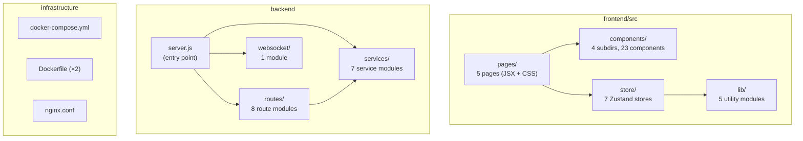

### 4.3.2. Frontend Package Design

The frontend is a React SPA built with Vite, using Zustand for state management.

**Pages** ([pages/](file:///f:/soict_stock/frontend/src/pages)):
- [Landing.jsx](file:///f:/soict_stock/frontend/src/pages/Landing.jsx) — Public homepage with hero section and feature highlights
- [Simulation.jsx](file:///f:/soict_stock/frontend/src/pages/Simulation.jsx) — Main trading interface (chart, watchlist, order form, AI chat)
- [Portfolio.jsx](file:///f:/soict_stock/frontend/src/pages/Portfolio.jsx) — Portfolio dashboard with holdings, P&L, risk metrics
- [Leaderboard.jsx](file:///f:/soict_stock/frontend/src/pages/Leaderboard.jsx) — Competitive ranking table
- [Learn.jsx](file:///f:/soict_stock/frontend/src/pages/Learn.jsx) — Educational hub

**Components** ([components/](file:///f:/soict_stock/frontend/src/components)):
- `simulation/` — StockChart, Watchlist, OrderForm, OrderBook, TopBar, NewsPanel, AIChatPanel, PortfolioPanel, ScenarioSelector (9 components)
- `shared/` — AuthModal, Badge, DonutChart, Modal, NewsModal, SparklineChart, StatCard, Toast (10 components)
- `layout/` — Navbar, Footer, UserMenu (5 files)
- `learn/` — LessonCard, MarketAnalysisLab, PatternGame, QuizModule (4 components)

**Stores** ([store/](file:///f:/soict_stock/frontend/src/store)):
- [marketStore.js](file:///f:/soict_stock/frontend/src/store/marketStore.js) — Prices, tick history, WebSocket state management
- [portfolioStore.js](file:///f:/soict_stock/frontend/src/store/portfolioStore.js) — Holdings, cash, transactions, snapshots
- [orderStore.js](file:///f:/soict_stock/frontend/src/store/orderStore.js) — Open/filled orders, order checking
- [newsStore.js](file:///f:/soict_stock/frontend/src/store/newsStore.js) — News feed, generation, fetching
- [authStore.js](file:///f:/soict_stock/frontend/src/store/authStore.js) — User authentication state
- [leaderboardStore.js](file:///f:/soict_stock/frontend/src/store/leaderboardStore.js) — Leaderboard data
- [settingsStore.js](file:///f:/soict_stock/frontend/src/store/settingsStore.js) — App settings

**Libraries** ([lib/](file:///f:/soict_stock/frontend/src/lib)):
- [api.js](file:///f:/soict_stock/frontend/src/lib/api.js) — HTTP client wrapper for backend API calls
- [constants.js](file:///f:/soict_stock/frontend/src/lib/constants.js) — Stock definitions, sector data, scenario configs
- [formatters.js](file:///f:/soict_stock/frontend/src/lib/formatters.js) — Currency, number, date formatting utilities
- [indicators.js](file:///f:/soict_stock/frontend/src/lib/indicators.js) — Technical indicators (SMA, RSI, etc.)
- [learningData.js](file:///f:/soict_stock/frontend/src/lib/learningData.js) — Educational content (lessons, quizzes)

### 4.3.3. Backend Package Design

**Entry Point:** [server.js](file:///f:/soict_stock/backend/server.js) — Connects to MongoDB, initializes services, registers routes, starts WebSocket server.

**Routes** ([routes/](file:///f:/soict_stock/backend/routes)):
- [auth.js](file:///f:/soict_stock/backend/routes/auth.js) — POST /signup, POST /signin, GET /profile, PUT /profile
- [market.js](file:///f:/soict_stock/backend/routes/market.js) — GET /stocks, GET /history/:ticker, GET /quote/:ticker
- [orders.js](file:///f:/soict_stock/backend/routes/orders.js) — POST /, GET /, DELETE /:id
- [portfolio.js](file:///f:/soict_stock/backend/routes/portfolio.js) — GET /, POST /trade, GET /history, GET /risk
- [leaderboard.js](file:///f:/soict_stock/backend/routes/leaderboard.js) — GET /
- [news.js](file:///f:/soict_stock/backend/routes/news.js) — GET /
- [advisor.js](file:///f:/soict_stock/backend/routes/advisor.js) — POST /chat, POST /backtest
- [scenarios.js](file:///f:/soict_stock/backend/routes/scenarios.js) — POST /:id/activate, POST /deactivate

**Services** ([services/](file:///f:/soict_stock/backend/services)):
- [db.js](file:///f:/soict_stock/backend/services/db.js) — MongoDB singleton connection, index creation
- [simulationEngine.js](file:///f:/soict_stock/backend/services/simulationEngine.js) — GBM pricing, tick generation, history management
- [orderBook.js](file:///f:/soict_stock/backend/services/orderBook.js) — Order execution, pending order management
- [newsInjector.js](file:///f:/soict_stock/backend/services/newsInjector.js) — News lifecycle, price shock application
- [newsService.js](file:///f:/soict_stock/backend/services/newsService.js) — GNews API client, headline NLP analysis
- [riskMetrics.js](file:///f:/soict_stock/backend/services/riskMetrics.js) — Financial risk calculations
- [stockData.js](file:///f:/soict_stock/backend/services/stockData.js) — 30 stock definitions across 6 sectors

**WebSocket** ([websocket/](file:///f:/soict_stock/backend/websocket)):
- [priceStream.js](file:///f:/soict_stock/backend/websocket/priceStream.js) — WebSocket setup, init payload, tick broadcasting

## 4.4. Detailed Class Design

| Entity/Module | Main Data | Main Operations |
|--------------|-----------|-----------------|
| **SimulationEngine** | stocks, prices, regime, driftOverrides, volatilityMultipliers, listeners, intervalId | initialize(), tick(), start(), stop(), setRegime(), applyShock(), getQuote(), getTickHistory(), getAllTickHistory() |
| **OrderBookService** | engine (ref) | placeOrder(), _executeMarketOrder(), checkPendingOrders(), cancelOrder(), getOpenOrders(), getFilledOrders(), getDepth() |
| **NewsInjector** | engine, newsService, news[], realNewsUsed | start(), stop(), injectNews(), _fetchRealNews(), _generateFallbackNews(), getNews() |
| **NewsService** | apiKey, cachedArticles, lastFetch | fetchNews(), getLatest(), _requestJson() |
| **RiskMetrics** | (stateless) | sharpeRatio(), maxDrawdown(), volatility(), beta(), winRate(), profitFactor() |
| **STOCKS (data)** | 30 stock objects | ticker, name, fullName, sector, color, basePrice, drift, volatility |

### Price Generation Algorithm (GBM with Mean Reversion)

```
nextPrice(price, drift, vol, dt, fairValue):
    effectiveDrift = drift + driftOverride[regime]
    effectiveVol = vol × volMultiplier[regime]

    // Soft mean reversion (κ = 0.02/day)
    if fairValue:
        logDev = ln(price / fairValue)
        effectiveDrift -= κ × logDev × 252 × dt

    z = BoxMuller()  // Standard normal random
    next = price × exp((effectiveDrift - 0.5 × effectiveVol²) × dt 
                       + effectiveVol × √dt × z)

    // Hard clamp: ±60% from fair value
    next = clamp(next, fairValue, 0.60)
    return max(0.01, next)
```

## 4.5. Detailed Class Diagram

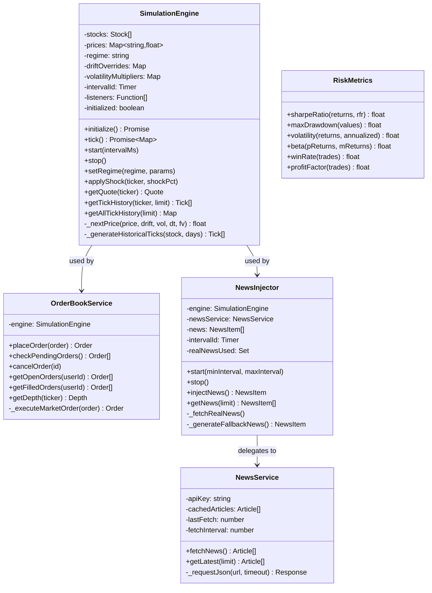

## 4.6. Interface Design

### 4.6.1. Main Screens

| Screen | Purpose |
|--------|---------|
| **Landing Page** | Public homepage with hero section, platform description, feature highlights (Simulation, AI Advisor, Learning), and CTA buttons. |
| **Simulation** | Full trading dashboard: candlestick chart (lightweight-charts), watchlist with real-time prices, order form (Market/Limit/Stop), order book depth, news panel, AI advisor chat, mini portfolio panel, and scenario selector. |
| **Portfolio** | Portfolio overview: stat cards (total value, cash, P&L, return %), holdings table with per-stock metrics, allocation donut chart, transaction history, risk metrics (Sharpe, drawdown, volatility), and performance sparkline. |
| **Leaderboard** | Ranked trader table: rank (with medal icons for top 3), display name, portfolio value, total return %, Sharpe ratio, trade count. |
| **Learn** | Educational hub: lesson cards with progress tracking, quiz modules, pattern recognition game, and market analysis lab. |

### 4.6.2. Navigation Structure

| Element | Description |
|---------|-------------|
| Navbar | Persistent top navigation with SoictStock logo, page links (Home, Simulation, Portfolio, Leaderboard, Learn), and user menu (login/register or profile/logout). |
| Footer | Branding footer with links, description, and copyright. |
| Toast | Notification system for success/error/info messages. |
| Auth Modal | Overlay modal for login/register with tab switching. |

---

# CHAPTER 5. DEMO PROGRAM IMPLEMENTATION

## 5.1. Tools and Libraries

### Tools

| Purpose | Tool | Version | Note |
|---------|------|---------|------|
| IDE | Visual Studio Code | Recommended | Main code editor |
| Frontend framework | React | 19.2.5 | With Vite 8.0.10 as build tool |
| State management | Zustand | 5.0.12 | Lightweight alternative to Redux |
| Routing | React Router DOM | 7.14.2 | Client-side routing |
| Backend framework | Express.js | 4.18.2 | Node.js REST API server |
| Database | MongoDB | 7 (Docker image) | Or MongoDB Atlas cloud |
| WebSocket | ws | 8.16.0 | Real-time price streaming |
| Charting | lightweight-charts | 5.2.0 | Trading candlestick charts |
| Analytics charts | recharts | 3.8.1 | Portfolio donut/line charts |
| Deployment | Docker + Docker Compose | 3.8 spec | 3-service deployment |

### Libraries

| Purpose | Library | Version | Note |
|---------|---------|---------|------|
| Authentication | bcryptjs | 3.0.3 | Password hashing (10 rounds) |
| CORS | cors | 2.8.5 | Cross-origin request handling |
| Environment | dotenv | 17.4.2 | .env file loading |
| MongoDB Driver | mongodb | 7.3.0 | Native driver (no Mongoose) |
| UUID | uuid | 9.0.0 | Unique ID generation |

## 5.2. Demo Program Results

| No. | Function | Status | Note |
|-----|----------|--------|------|
| 1 | User registration and authentication | Implemented | bcryptjs password hashing; email uniqueness check |
| 2 | Market simulation (GBM pricing) | Implemented | 30 stocks, 6 sectors, 3-second ticks |
| 3 | Historical data generation | Implemented | 90 days × 78 bars/day per stock |
| 4 | Real-time WebSocket streaming | Implemented | Init + tick messages |
| 5 | Market/Limit/Stop order execution | Implemented | With slippage modeling |
| 6 | Portfolio management | Implemented | Cash, holdings, P&L, snapshots |
| 7 | Risk metrics calculation | Implemented | Sharpe, drawdown, volatility, beta |
| 8 | Leaderboard ranking | Implemented | Auto-updated on each trade |
| 9 | Real news integration (GNews API) | Implemented | 10-min cache, keyword NLP |
| 10 | Fallback news generation | Implemented | 8 event templates |
| 11 | AI Advisory chat | Implemented | 3 strategy modes + backtesting |
| 12 | Historical crisis scenarios | Implemented | 4 scenarios (2008, COVID, Tech Bubble, Inflation) |
| 13 | Educational modules | Implemented | Lessons, quizzes, pattern game, analysis lab |
| 14 | Interactive candlestick charts | Implemented | lightweight-charts with timeframe switching |

### Source Code Statistics

| Component | Lines of code | Files/modules | Source size |
|-----------|:------------:|:------------:|:----------:|
| Frontend (React) | ~5,000+ | 33+ | ~180 KB |
| Backend (Express) | ~1,200+ | 16 | ~45 KB |
| Configuration | ~100 | 5 | ~3 KB |

## 5.3. Demo Interface Screenshots

> [!NOTE]
> Screenshots should be captured from the running application and inserted here. The main screens to capture are:
> 1. Landing page with hero section
> 2. Login/Register modal
> 3. Simulation page with candlestick chart and watchlist
> 4. Order placement form with Market/Limit/Stop options
> 5. Portfolio dashboard with holdings and risk metrics
> 6. Leaderboard ranking table
> 7. News feed with sentiment badges
> 8. AI Advisor chat panel
> 9. Scenario selector (crisis simulation)
> 10. Learn page with educational modules

---

# CHAPTER 6. SYSTEM TESTING

## 6.1. Testing Implemented Functions

**Testing technique:** API functional testing, black-box testing, and end-to-end flow testing.

**Testing environment:** Localhost with Node.js, MongoDB, and a modern web browser (Chrome/Edge).

### Test Case 1: Registration with Duplicate Email

| Item | Description |
|------|-------------|
| Test No. | TC-AUTH-01 |
| Status | ✅ Passed |
| Title | Check registration with an already-used email |
| Description | Verify that the system prevents duplicate account creation and returns appropriate error. |
| Approach | Functional testing — invalid case |

| Step | Action | Expected Result |
|------|--------|-----------------|
| 1 | Register with email "test@example.com" | 201 Created, user returned |
| 2 | Register again with same email | 409 Conflict, "An account with this email already exists" |

**Concluding remark:** The unique index on `users.email` combined with the `findOne` pre-check correctly prevents duplicate registrations.

### Test Case 2: Login with Invalid Password

| Item | Description |
|------|-------------|
| Test No. | TC-AUTH-02 |
| Status | ✅ Passed |
| Title | Check login with incorrect password |
| Description | Verify that the system denies access with wrong credentials. |

| Step | Action | Expected Result |
|------|--------|-----------------|
| 1 | POST /api/auth/signin with valid email, wrong password | 401 "Invalid email or password" |
| 2 | Verify no user state is stored on frontend | User remains unauthenticated |

### Test Case 3: Market Order with Insufficient Funds

| Item | Description |
|------|-------------|
| Test No. | TC-TRADE-01 |
| Status | ✅ Passed |
| Title | Check trade rejection when funds are insufficient |

| Step | Action | Expected Result |
|------|--------|-----------------|
| 1 | User has $150,000 cash | Portfolio loaded |
| 2 | Attempt to buy 2000 shares of TECH at ~$315.80 (total ~$631,600) | 400 "Insufficient funds" |
| 3 | Verify portfolio unchanged | Cash remains $150,000 |

### Test Case 4: Sell More Shares Than Owned

| Item | Description |
|------|-------------|
| Test No. | TC-TRADE-02 |
| Status | ✅ Passed |
| Title | Check sell rejection when shares are insufficient |

| Step | Action | Expected Result |
|------|--------|-----------------|
| 1 | User holds 100 shares of SCT | Holdings verified |
| 2 | Attempt to sell 200 shares of SCT | 400 "Insufficient shares" |
| 3 | Verify holdings unchanged | 100 shares remain |

### Test Case 5: Scenario Activation and Deactivation

| Item | Description |
|------|-------------|
| Test No. | TC-SCENARIO-01 |
| Status | ✅ Passed |
| Title | Check scenario regime switching |

| Step | Action | Expected Result |
|------|--------|-----------------|
| 1 | POST /api/scenarios/covid_2020/activate | "Activated: COVID March 2020" |
| 2 | Observe price behavior | Increased volatility (4×), negative drift |
| 3 | POST /api/scenarios/deactivate | "Scenario deactivated" |
| 4 | Observe price behavior | Normal volatility restored |

### Test Case 6: WebSocket Reconnection Fallback

| Item | Description |
|------|-------------|
| Test No. | TC-WS-01 |
| Status | ✅ Passed |
| Title | Check frontend behavior when WebSocket disconnects |

| Step | Action | Expected Result |
|------|--------|-----------------|
| 1 | Connect to WebSocket, receive init data | Charts populated with server history |
| 2 | Stop backend server | WebSocket onclose fires, `isConnected = false` |
| 3 | Observe frontend | Local `simulateTick()` starts as fallback |
| 4 | Restart backend | WebSocket reconnects on next attempt |

### Test Case 7: News Impact on Stock Prices

| Item | Description |
|------|-------------|
| Test No. | TC-NEWS-01 |
| Status | ✅ Passed |
| Title | Check that news injection applies price shocks correctly |

| Step | Action | Expected Result |
|------|--------|-----------------|
| 1 | Note current price of SCT | e.g., $128.45 |
| 2 | NewsInjector generates positive earnings news for SCTech | Impact: +5% to +15% |
| 3 | Observe SCT price | Price increases by shock amount (capped ±8%) |
| 4 | Verify news appears in news collection | News item persisted with sentiment and impact |

## 6.2. Testing Non-Functional Requirements

| Requirement | Test Method | Expected Result | Status |
|------------|-------------|-----------------|--------|
| **Usability** | User completes registration, first trade, and portfolio check without instructions | User can complete core tasks intuitively | ✅ Passed |
| **Performance** | Measure tick generation cycle for 30 stocks | Each tick cycle < 100ms | ✅ Passed |
| **Performance** | Load 26,000 ticks for chart rendering | Response within 2 seconds | ✅ Passed |
| **Reliability** | Kill MongoDB mid-operation, restart | Server reconnects; data integrity maintained | ✅ Passed |
| **Reliability** | Submit duplicate news (same _id) | Silently ignored (error code 11000) | ✅ Passed |
| **Security** | Verify password not returned in API responses | `passwordHash` excluded from all responses | ✅ Passed |
| **Maintainability** | Review project structure | Frontend (pages/components/stores/lib) and Backend (routes/services/websocket) cleanly separated | ✅ Passed |

---

# CHAPTER 7. INSTALLATION AND USER GUIDE

## 7.1. Target Users and Scope

### Target Users
- **Students:** Learning stock market fundamentals through simulation.
- **Aspiring Investors:** Practicing trading strategies in a risk-free environment.
- **Educators:** Using the platform as a teaching tool for financial literacy courses.

### Scope of Use
A local or cloud-deployed web application for virtual stock market simulation. The system allows users to trade 30 virtual stocks, track portfolios, compete on leaderboards, receive AI advisory, and learn through interactive modules.

## 7.2. System Requirements

### Hardware Requirements

| Item | Requirement |
|------|------------|
| CPU | Modern multi-core CPU (Intel i5+ or Apple Silicon) |
| RAM | At least 4 GB RAM |
| Storage | At least 1 GB free space |
| Network | Internet for GNews API (optional) and MongoDB Atlas |

### Software Requirements

| Item | Requirement |
|------|------------|
| Operating System | Windows, macOS, or Linux |
| Node.js | v18+ (recommended v20+) |
| npm | v9+ |
| MongoDB | v7 (via Docker) or MongoDB Atlas |
| Browser | Chrome, Edge, Firefox, or Safari (latest) |
| Docker | Optional (for MongoDB container) |

## 7.3. Installation and Deployment

### Option A: Local Development

```bash
# Step 1: Clone repository
git clone <repository-url>
cd soict_stock

# Step 2: Install backend dependencies
cd backend
npm install

# Step 3: Configure environment
# Create or edit backend/.env:
# MONGODB_URI=mongodb://localhost:27017
# GNEWS_API_KEY=<your-gnews-api-key>

# Step 4: Start MongoDB (Docker)
docker run -d -p 27017:27017 --name mongodb mongo:7

# Step 5: Start backend server
npm run dev
# Server starts on http://localhost:3001

# Step 6: Install and start frontend
cd ../frontend
npm install
npm run dev
# Frontend starts on http://localhost:5173
```

### Option B: Docker Compose (Production)

```bash
# From project root:
docker compose up --build

# Services:
# - MongoDB: localhost:27017
# - Backend: localhost:3001
# - Frontend: localhost:80
```

### Option C: MongoDB Atlas (Cloud)

1. Create a cluster on [MongoDB Atlas](https://www.mongodb.com/atlas)
2. Get connection string
3. Set in `backend/.env`:
   ```
   MONGODB_URI=mongodb+srv://<user>:<password>@<cluster>.mongodb.net/?retryWrites=true&w=majority
   ```
4. Start backend: `npm run dev`

## 7.4. User Guide

### 7.4.1. Register and Login
1. Click "Get Started" on the landing page or "Login" in the navbar.
2. Switch to the "Register" tab in the auth modal.
3. Enter email, password (≥6 characters), and optional display name.
4. Click Register. You now have $150,000 to trade!

### 7.4.2. Trading Stocks
1. Navigate to the **Simulation** page.
2. Select a stock from the **Watchlist** on the left.
3. View the **candlestick chart** and **order book depth**.
4. In the **Order Form**: select Buy/Sell, choose order type (Market/Limit/Stop), enter quantity.
5. Click "Place Order."

### 7.4.3. Managing Portfolio
1. Navigate to the **Portfolio** page.
2. View your holdings, unrealized P&L, and total portfolio value.
3. Check risk metrics: Sharpe ratio, max drawdown, volatility.
4. Review transaction history.

### 7.4.4. Using AI Advisor
1. On the Simulation page, open the **AI Chat** panel.
2. Select a strategy mode (Trend / Mean Reversion / Value).
3. Send a message to receive tailored advice.

### 7.4.5. Activating Market Scenarios
1. On the Simulation page, open the **Scenario Selector**.
2. Choose a historical scenario (e.g., "COVID March 2020").
3. Watch prices react with modified drift and volatility.
4. Click "Deactivate" to return to normal.

### 7.4.6. Learning
1. Navigate to the **Learn** page.
2. Browse lesson cards and click to read.
3. Take quizzes to test your knowledge.
4. Try the Pattern Recognition Game and Market Analysis Lab.

---

> [!NOTE]
> **Document Version:** 1.0  
> **Last Updated:** June 2026  
> **Course:** IT3180 – Introduction to Software Engineering  
> **University:** Hanoi University of Science and Technology (HUST)  
> **School:** School of Information and Communication Technology
